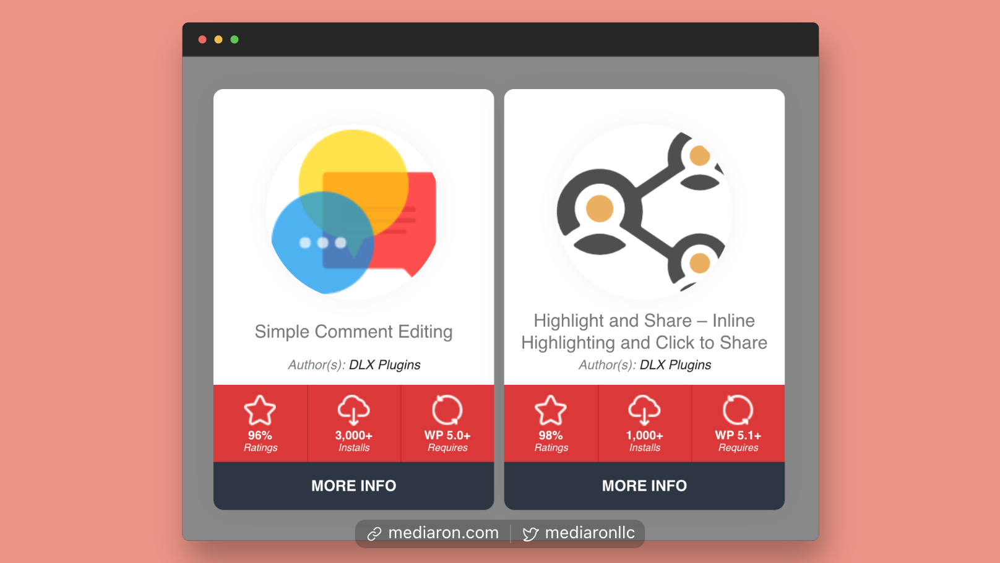

# Welcome to WP Plugin Info Card

<figure><figcaption>
WP Plugin Info Card - Card Layout
</figcaption></figure>

WP Plugin Info Card is the easiest way to showcase WordPress.org hosted plugins and themes.


[View the French documentation](https://www.b-website.com/wp-plugin-info-card-plugin-base-plugin-api-wordpress-org/)


With four layouts, 14 color schemes, and 3 helper shortcodes/blocks, you'll find WP Plugin Info Card flexible enough to meet your design and layout needs.

### WP Plugin Info Card Quick Teaser

Please view the video below for a brief teaser of what WP Plugin Info Card can do for your site.


WP Plugin Info Card Brief Overview


### WP Plugin Info Card In-depth Overview

This thirteen-minute video (below) gives you an extensive overview of how WP Plugin Info Card works.


In-depth Overview of WP Plugin Info Card


