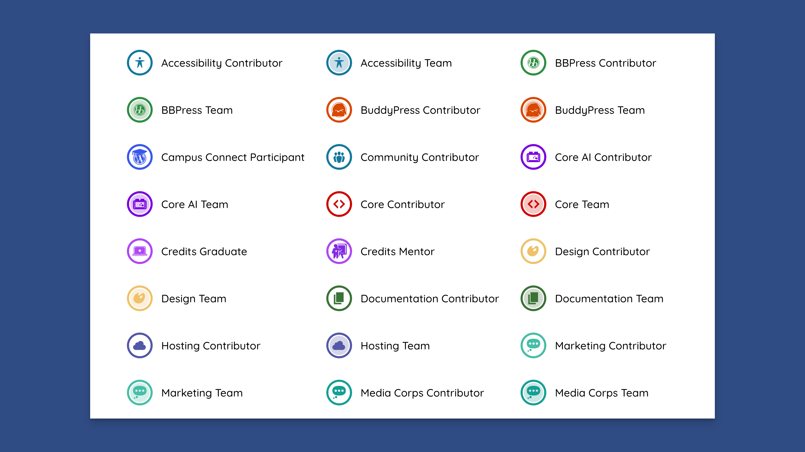
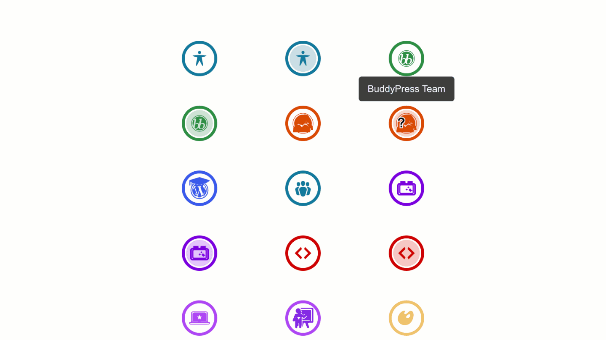
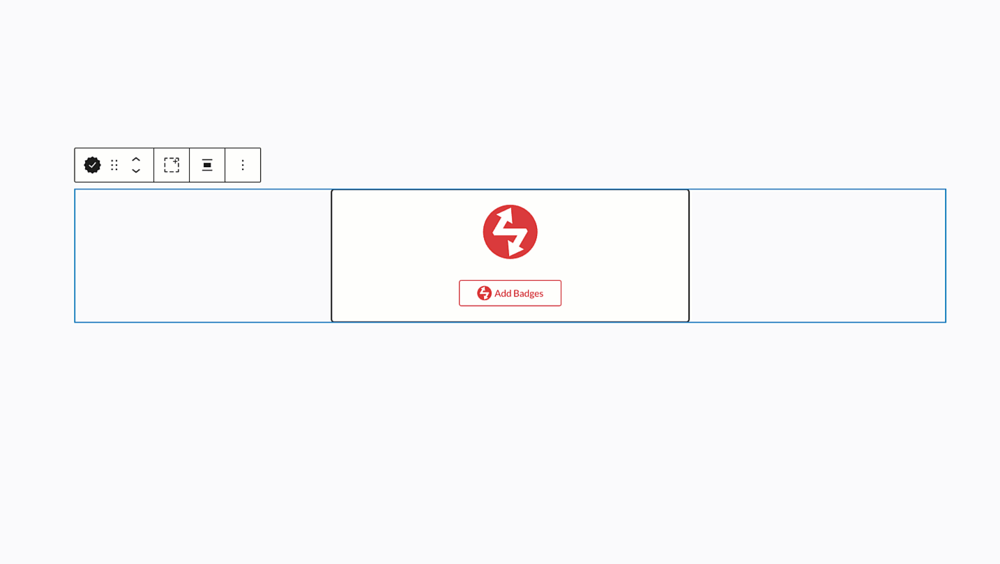
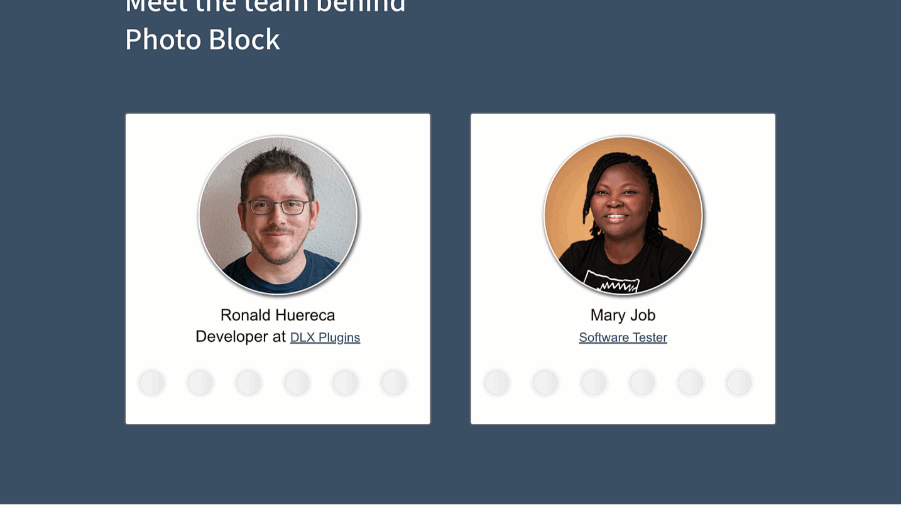
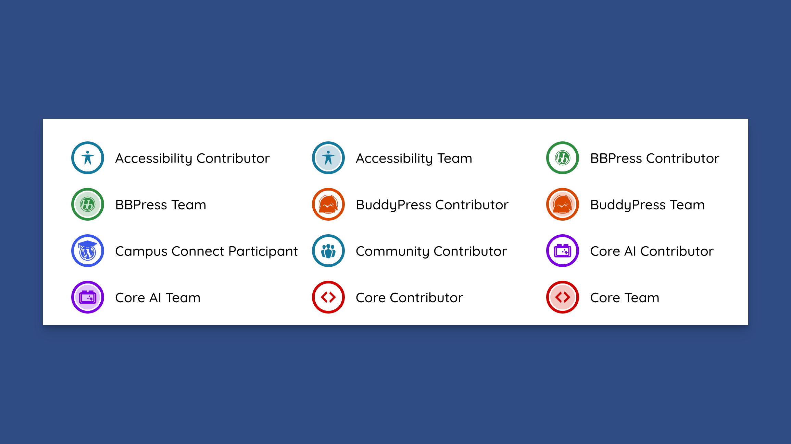
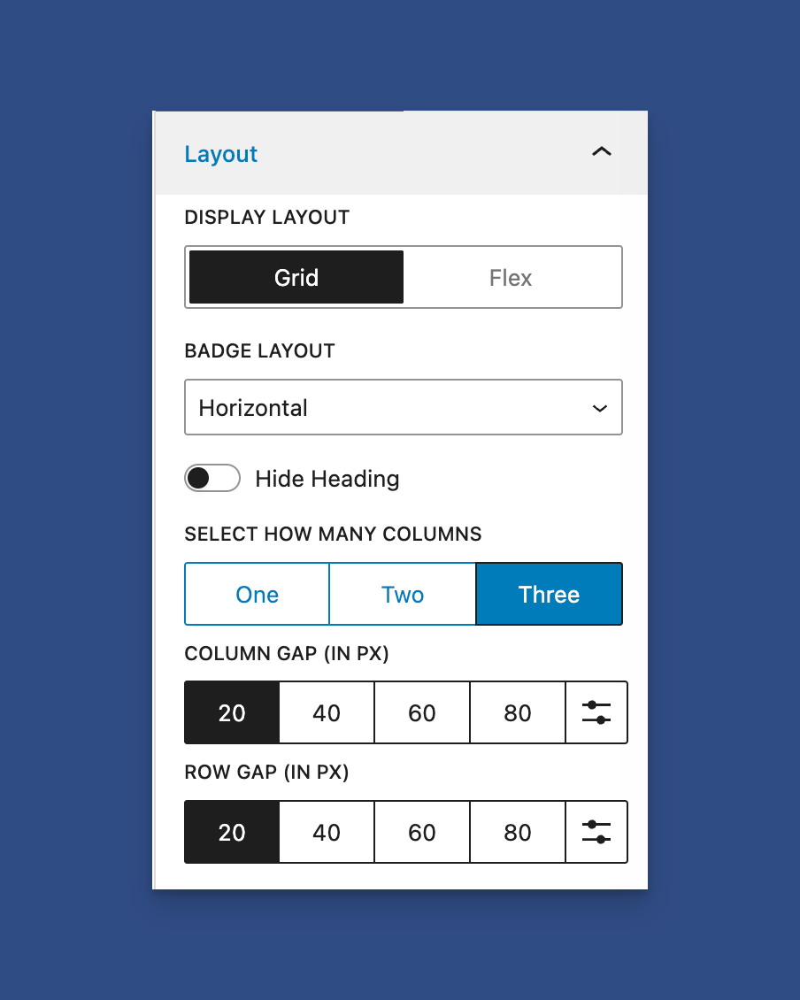
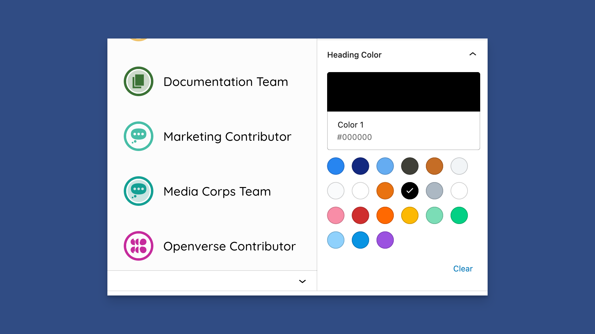

# Badges Block

### Welcome to .org Profile Badges

Profile Badges let you showcase your WordPress.org contributions on your website! Display your badges from WordPress.org profiles in beautiful, customizable layouts using the block editor.

<figure><figcaption><p>Grid Showing .org Profile Badges</p></figcaption></figure>


This feature requires Dashicons to work. If you have a plugin that disables Dashicons, such as Perfmatters, please re-enable them.


### What Are Profile Badges?

WordPress.org recognizes contributors with badges for their contributions to the WordPress project. These badges include:

* **Core Contributor** - For contributing to WordPress core
* **Plugin Developer** - For publishing plugins
* **Theme Developer** - For publishing themes
* **Design Contributor** - For design contributions
* **Translation Contributor** - For translation work
* **And many more!**

<figure><figcaption><p>Badges Showing Tooltips and Hover Effects</p></figcaption></figure>

### Getting Started

Profile Badges uses the WordPress block editor, providing a visual, drag-and-drop interface that makes it easy to add and customize your badges.

<figure><figcaption><p>Dynamic Badges Block</p></figcaption></figure>

### Using the Block Editor

#### Step 1: Add the Profile Badges Block

1. In the WordPress block editor, click the **+** button to add a new block
2. Search for "Profile Badges" or "Badges"
3. Click on **Profile Badges - Dynamic** to insert the block

<figure><figcaption><p>Adding a Dynaimc .org Badges Block</p></figcaption></figure>

#### Step 2: Choose Your Badge Type

You'll see two options in the block sidebar:

**Option A: Custom Badges (Manual Selection)**

Select specific badges to display manually.

<figure><figcaption><p>Static (Custom) Badges Block</p></figcaption></figure>

**Option B: Dynamic Badges (Automatic from WordPress.org)**

Automatically fetch badges from any WordPress.org profile.

<figure><figcaption><p>Dynamic Badges Block</p></figcaption></figure>

### Custom Badges - Step by Step

#### Selecting Your Badges

1. With the block selected, click the **Add Badges** button or click **Edit** in the toolbar.
2. A modal will open showing all available badges
3. Click on badges to select/deselect them
4. Use **Select All** or **Select None** for quick selection
5. Click **Save** when done

<figure><figcaption><p>Adding Custom Badges</p></figcaption></figure>

#### Available Badges

The badge selector shows all available WordPress.org badges organized by category. Each badge includes:

* Badge icon/visual
* Badge name/label

### Dynamic Badges - Step by Step

#### Setting Up Dynamic Badges

1. Select the Profile Badges block
2. In the sidebar, choose **Dynamic** as the type
3. Enter the WordPress.org **Author Slug** (username)
4. The badges will automatically load from that profile

<figure><figcaption><p>Adding a Dynaimc .org Badges Block</p></figcaption></figure>

#### How Dynamic Badges Work

* Badges are automatically fetched from WordPress.org
* Data is cached for 14 days for performance
* A loading skeleton appears while fetching
* Badges update automatically when the cache expires

<figure><figcaption><p>Lazy Loading Badges</p></figcaption></figure>

#### Finding Your Author Slug

Your author slug is your WordPress.org username. You can find it in your profile URL:

* Profile URL: `https://profiles.wordpress.org/your-username/`
* Author Slug: `your-username`

<figure><figcaption><p>.org Profile Highlighted</p></figcaption></figure>

### Layout Options

Profile Badges offers two robust layout systems: **Grid** and **Flex**.

#### Grid Layout (Structured Columns)

Grid layout provides structured, column-based layouts perfect for organized displays.

**Features:**

* Fixed column count (1, 2, or 3 columns)
* Consistent spacing
* Perfect alignment
* Best for: Showcasing specific badges in an organized way

<figure><figcaption><p>3-Column Badges Grid</p></figcaption></figure>

**Setting Up Grid Layout:**

1. In the block sidebar, ensure **Display Layout** is set to **Grid**
2. Choose your column count (1, 2, or 3)
3. Adjust column and row gaps as needed

<figure><figcaption><p>Adjusting the Grid Sidebar Options</p></figcaption></figure>

#### Flex Layout (Fluid Wrapping)

Flex layout provides fluid, responsive layouts that adapt to the width of your container.

<figure><figcaption><p>Flex Layout With Headings Hidden</p></figcaption></figure>

**Features:**

* Badges wrap naturally based on available space
* Responsive to container width
* No fixed column count
* Best for: Responsive designs and varying content widths

**Setting Up Flex Layout:**

1. In the block sidebar, set **Display Layout** to **Flex**
2. Column controls are hidden (not needed for flex)
3. Adjust gap spacing for your desired look

#### Grid vs. Flex: Which Should I Use?

**Use Grid when:**

* You want a structured, organized look
* You need consistent column alignment
* You're displaying a specific number of badges

**Use Flex when:**

* You want responsive, fluid layouts
* Your container width varies
* You want badges to wrap naturally
* You want icons only to display

### Customization Options

#### Badge Item Layout

Control how each badge item is displayed:

* **Horizontal** - Badge icon and title side by side
* **Centered** - Badge icon centered above the title

<figure><figcaption><p>Horizontal Layout vs Centered Layout</p></figcaption></figure>

#### Alignment

Control the overall alignment of your badge grid:

* **Left** - Align badges to the left
* **Center** - Center badges (default)
* **Right** - Align badges to the right

<figure><figcaption><p>Badge Alignment Options</p></figcaption></figure>

#### Spacing Controls

Fine-tune the spacing between badges:

* **Column Gap** - Horizontal spacing between badges (default: 20px)
* **Row Gap** - Vertical spacing between badge rows (default: 20px)

<figure><figcaption><p>Column and Row Gap</p></figcaption></figure>

#### Styling Options

**Base Font Size:**

* Control the overall size of badges (default: 16px)
* Larger values = bigger badges

<figure><figcaption><p>Increasing Badge Size</p></figcaption></figure>

**Heading Color:**

* Customize the color of badge titles
* Use hex color codes (e.g., #1e73be)

<figure><figcaption><p>Change Heading Color</p></figcaption></figure>

**Hide Heading:**

* Toggle to hide badge titles for a cleaner, icon-only display
* Tooltips appear on hover when headings are hidden

### Common Use Cases

#### Showcase Your Contributions

Display your WordPress.org badges on your personal website or portfolio.

<figure><figcaption><p>Showcasing Contributions to .org</p></figcaption></figure>

**Steps:**

1. Add Profile Badges block
2. Choose Dynamic type
3. Enter your WordPress.org username
4. Customize layout and styling

#### Highlight Team Members

Show badges for team members or contributors.

<figure><figcaption><p>Use Badges to Highlight .org Contributions</p></figcaption></figure>

**Steps:**

1. Add Profile Badges block
2. Choose Static type
3. Select relevant badges
4. Use a grid layout with 2-3 columns

#### Minimal Badge Display

Create a clean, icon-only badge display.

**Steps:**

1. Add Profile Badges block
2. Select your badges
3. Toggle "Hide Heading" on
4. Adjust spacing for a tight layout

#### Responsive Badge Gallery

Use a flex layout for badges that adapt to any screen size.

**Steps:**

1. Add Profile Badges block
2. Set Display Layout to Flex
3. Adjust gap spacing
4. Badges will wrap naturally on all devices

### Tips and Best Practices

#### Badge Selection Tips

* **Quality over Quantity**: Select badges that are most relevant to showcase
* **Group Related Badges**: Display related badges together (e.g., all design-related badges)
* **Use Modifiers**: Some badges include `has-overlay` modifier for special styling

#### Layout Tips

**Grid Layout:**

* Use 1 column for narrow spaces or single-column layouts
* Use 2-3 columns for wider areas
* Adjust gaps to match your site's spacing

**Flex Layout:**

* Perfect for responsive designs
* Badges wrap naturally on mobile devices
* Adjust gap for consistent spacing

#### Performance Tips

* **Static Badges**: Load instantly (no API calls)
* **Dynamic Badges**: Use caching (14 days) for optimal performance
* **Multiple Instances**: You can use multiple badge blocks on the same page

#### Accessibility

Profile Badges include built-in accessibility features:

* ARIA labels for screen readers
* Semantic HTML structure
* Tooltips when headings are hidden

### Troubleshooting

#### Badges Not Displaying

**Problem:** Badges don't appear on the frontend.

**Solutions:**

1. Check that badge names are spelled correctly
2. For dynamic badges, verify the author slug is correct
3. Clear your site cache
4. Check the browser console for JavaScript errors

#### Layout Issues

**Problem:** Badges aren't aligning correctly.

**Solutions:**

1. Check column count (1, 2, or 3 for grid layout)
2. Verify the container has sufficient width
3. Check for CSS conflicts with your theme
4. Try switching between grid and flex layouts

\[image - Before/after comparison showing layout issues and fixes]

#### Dynamic Badges Not Loading

**Problem:** Dynamic badges show a loading skeleton but never load.

**Solutions:**

1. Verify the author slug exists on WordPress.org
2. Check network connectivity
3. Clear the WP Plugin Info Card cache.
4. Check if the WordPress REST API is accessible

### Advanced Customization

#### Custom CSS

You can add custom CSS to further style your badges:

```css
.wppic-badges-grid {
    /* Your custom styles */
}
```

### Frequently Asked Questions

#### Can I display badges from multiple profiles?

Yes! You can add multiple Profile Badges blocks, each with a different author slug.

#### How often do dynamic badges update?

Dynamic badges are cached for 14 days. After that, they automatically refresh.

#### Can I customize badge colors?

Badge icons use their original WordPress.org colors. You can customize heading colors and overall sizing.

#### Do badges work on mobile?

Yes! Both grid and flex layouts are fully responsive and work great on mobile devices.

#### Can I use badges in widgets?

Yes! You can add the Profile Badges block to widget areas that support blocks, or use the shortcode in text widgets. See the shortcode documentation.


[wp-pic-badges.md](../shortcodes/wp-pic-badges.md)

