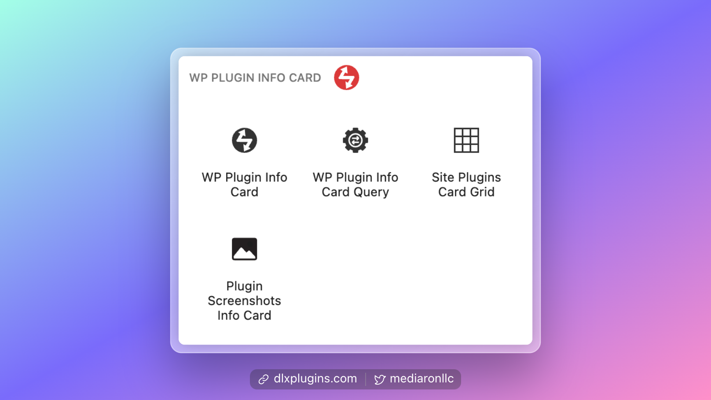

# Finding the Blocks

WP Plugin Info Card comes with three blocks.

You can find them in the block inserter (+ Button) under the WP Plugin Info Card category.

<figure><figcaption></figcaption></figure>

You can also use a `/` slash command and just type in `/plugin` to view the blocks.

<figure><figcaption></figcaption></figure>
