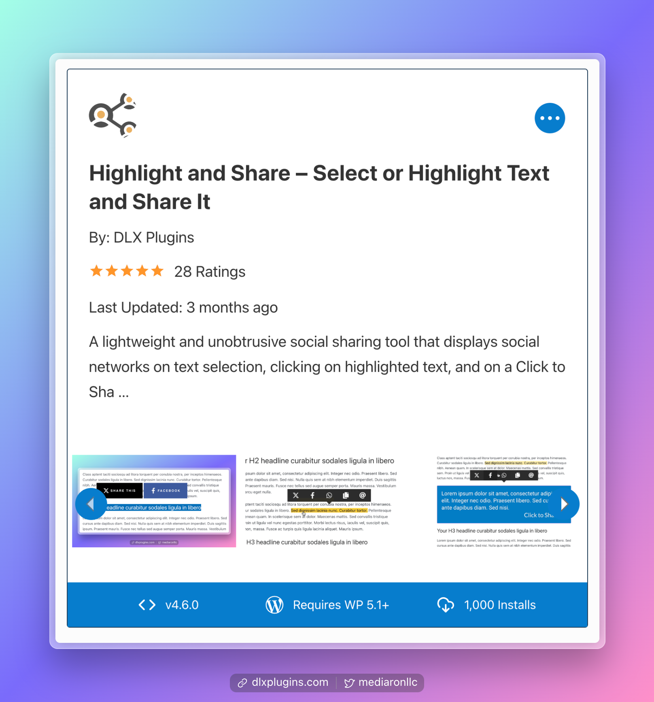
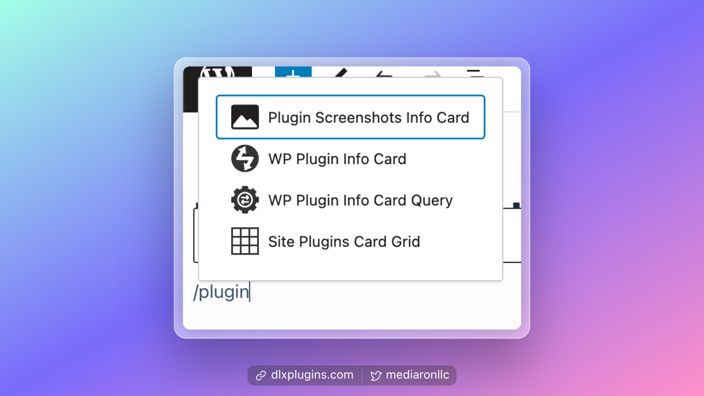
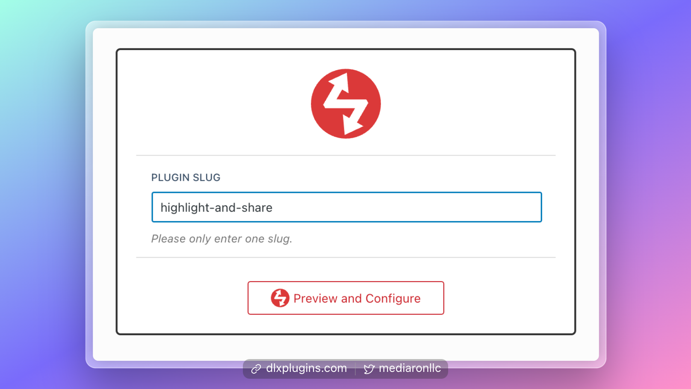
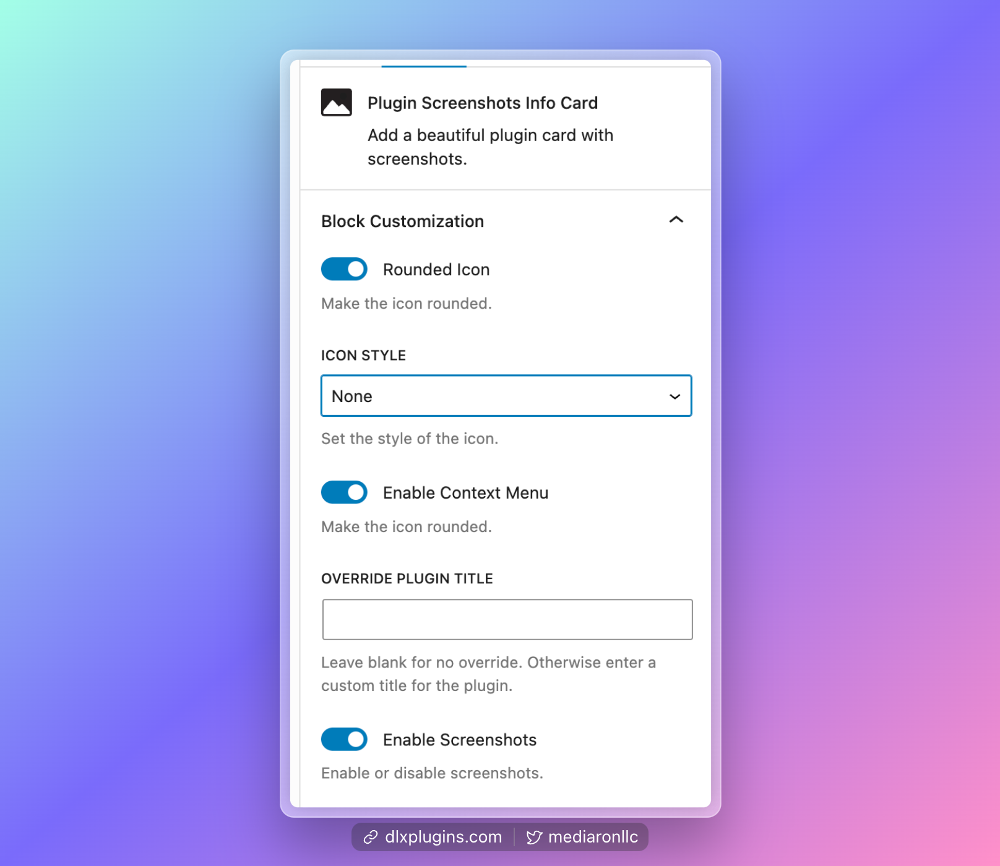
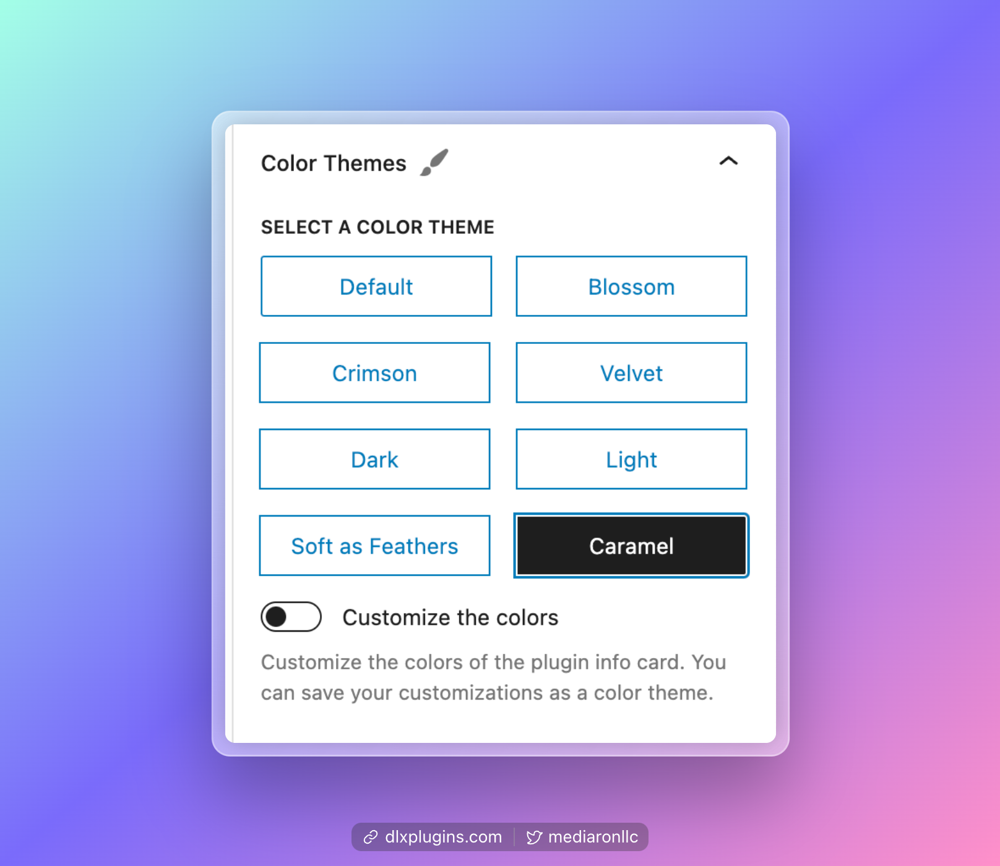
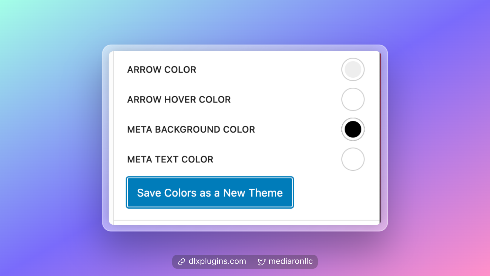

# Plugin Screenshots Info Card

<figure><figcaption>
Plugin Screenshots Card Block
</figcaption></figure>

The Plugin Screenshots Info Card block allows you to display the plugin's information along with any screenshots from WordPress.org.

Screenshots will pop up in a lightbox gallery when clicked on.

### Inserting the Block

Using the slash command, find the Plugin Screenshots Info Card block.

<figure><figcaption>
Slash Commands Help Find the Block Faster
</figcaption></figure>

### Configuring the Block

When you first enter the block, it will ask for the plugin slug. Go ahead and add your plugin slug; if it is found, you'll be taken to a new screen where you can configure the block.

<figure><figcaption>
Block Slug Prompt
</figcaption></figure>

### Block Options

<figure><figcaption>
Several Block Options Allow For Configuring
</figcaption></figure>

There are several block options, which can further customize the block.

#### Rounded Icons and Icon Style

You can adjust how the icon appears for the plugin, and even make the icon black & white.

#### Enable or Disable the Context Menu

The Context menu displays extra links to the plugin's various sections. If disabled, the context menu will not display.

#### Override the plugin title

Sometimes the plugin title can be a bit long or has marketing text in it. You can customize how the plugin title is output based on this override.

#### Enable or Disable Screenshots

If you want to display a plugin without screenshots, you can disable the option here.

### Color Themes

For the appearance of the block, there are several "color themes" to choose from.

<figure><figcaption>
There are eight color themes available
</figcaption></figure>

If you want to create a new color theme, select "Customize the colors," and you'll be able to select from several colors and be able to save your own custom color theme.

<figure><figcaption>
Save colors as a new color theme
</figcaption></figure>

