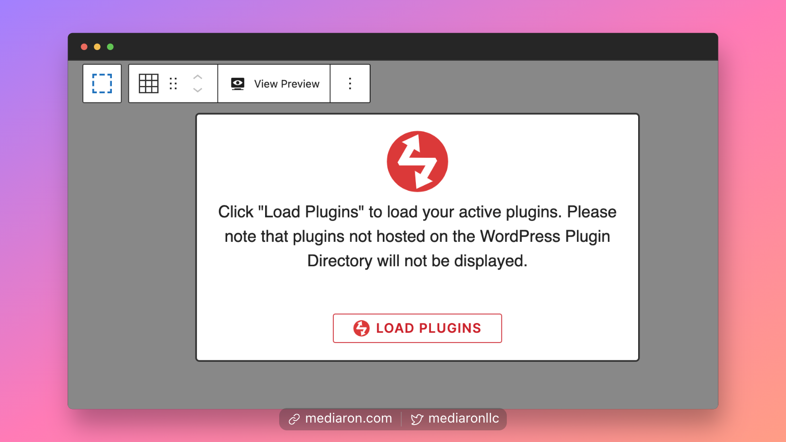
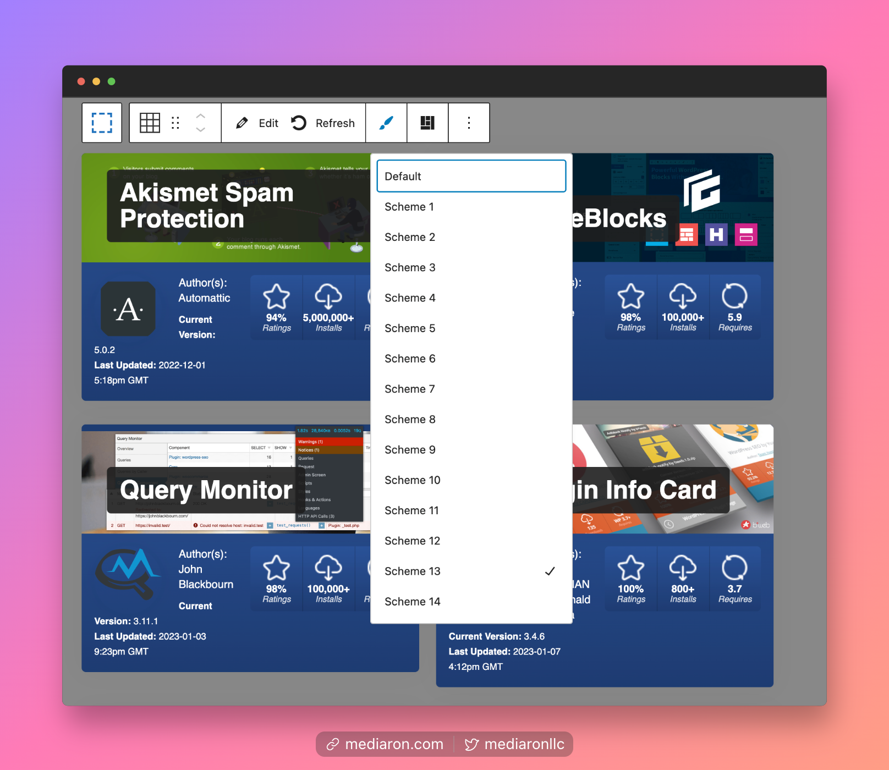
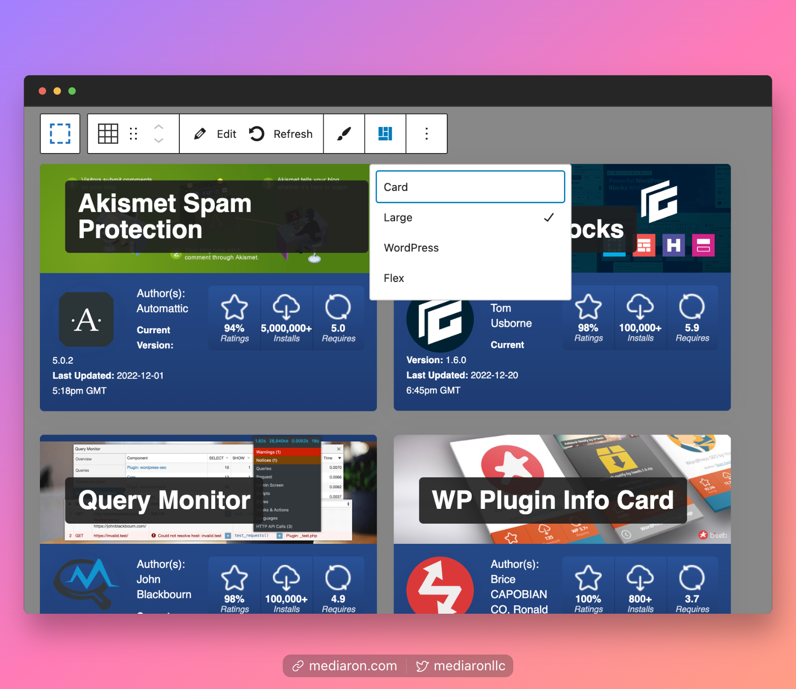
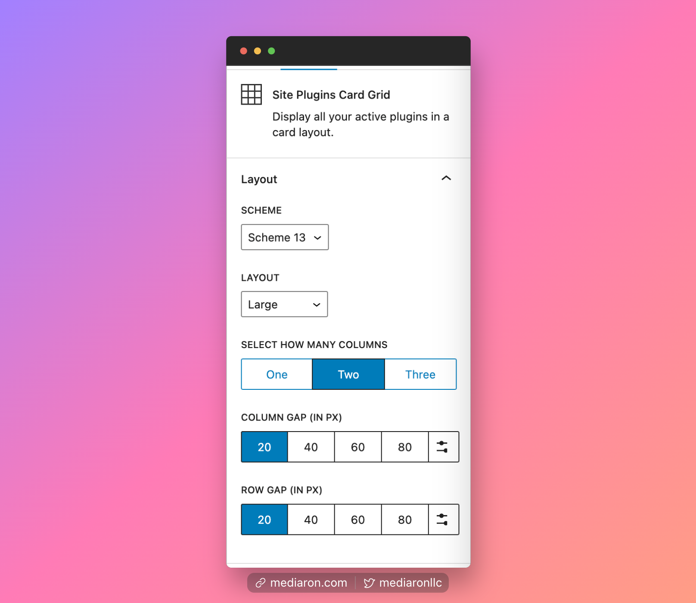

# Site Plugins Card Grid

The Site Plugins Card Grid block will allow you to display all of your active plugins.


The block can only output plugins listed on the WordPress Plugin Directory.


<figure><figcaption>
The First Step is to Load the Plugins
</figcaption></figure>

When you first insert the block, you'll have to load the plugins. Since these plugins are pinging the WordPress Plugin's API, it may take a minute to gather all of the information.

<figure><figcaption>
Select a Scheme
</figcaption></figure> <figure><figcaption>
Select a Layout
</figcaption></figure>

Once the plugins are loaded, you can change the scheme and layout used.

You can also use the sidebar options to configure even further.

<figure><figcaption>
Set Column Gap/Row Gap in the Sidebar Options
</figcaption></figure>

You can adjust the columns from 1-3 columns and also set a row and column gap for the grid.
