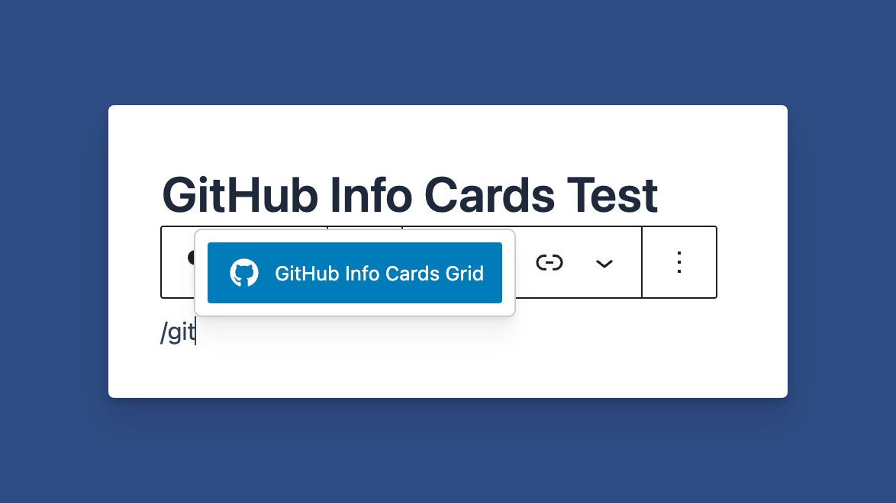
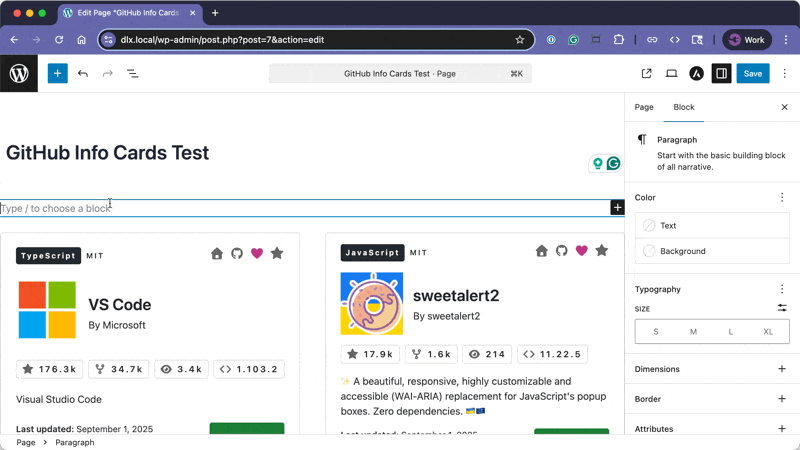
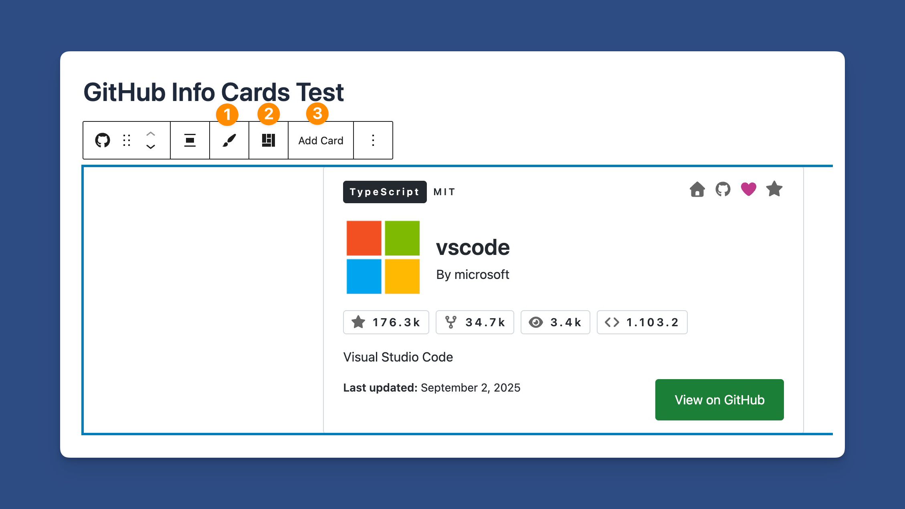
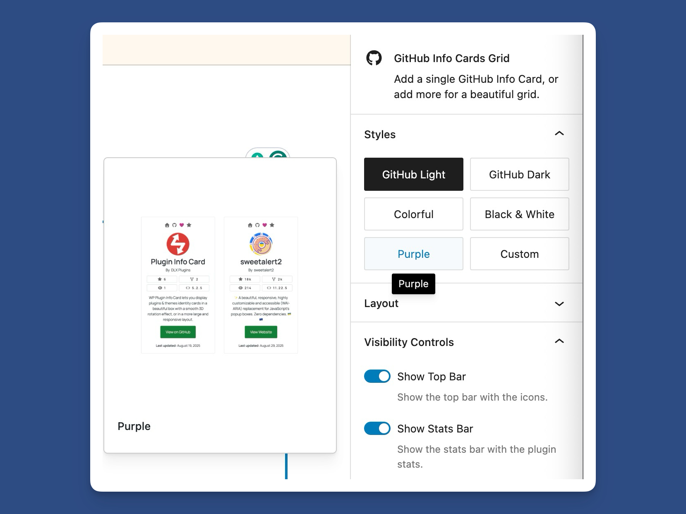
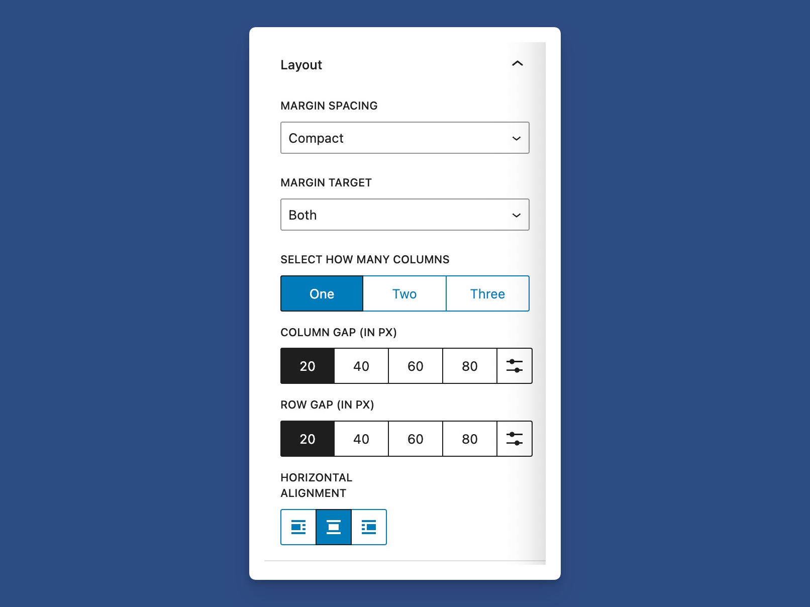
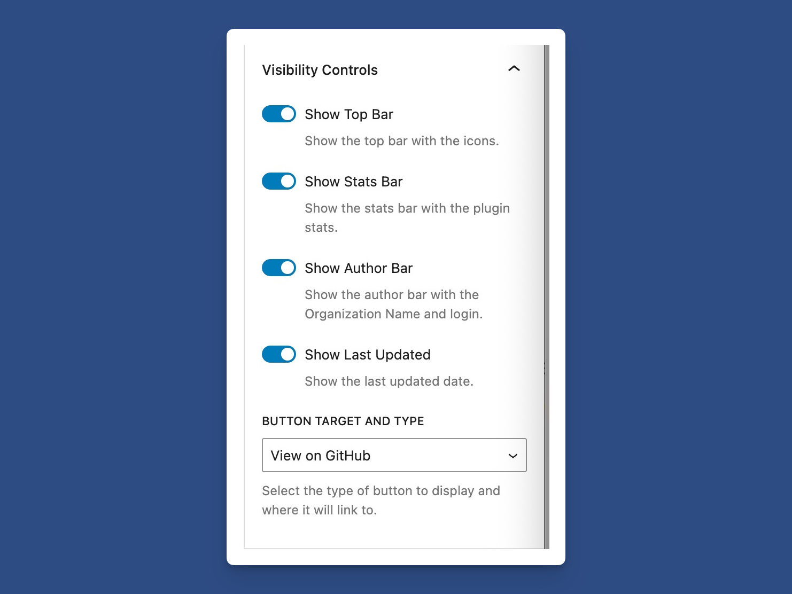
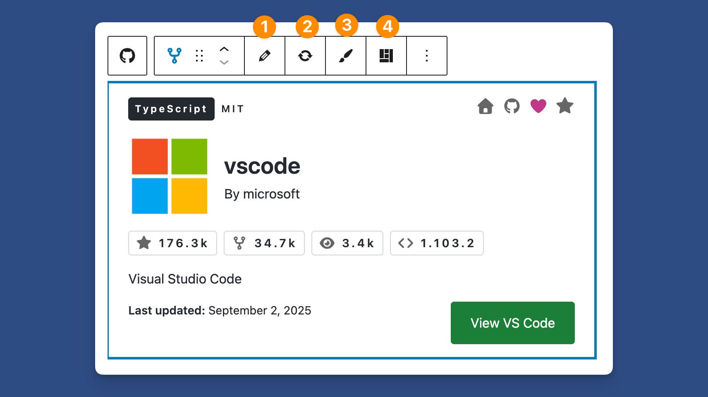
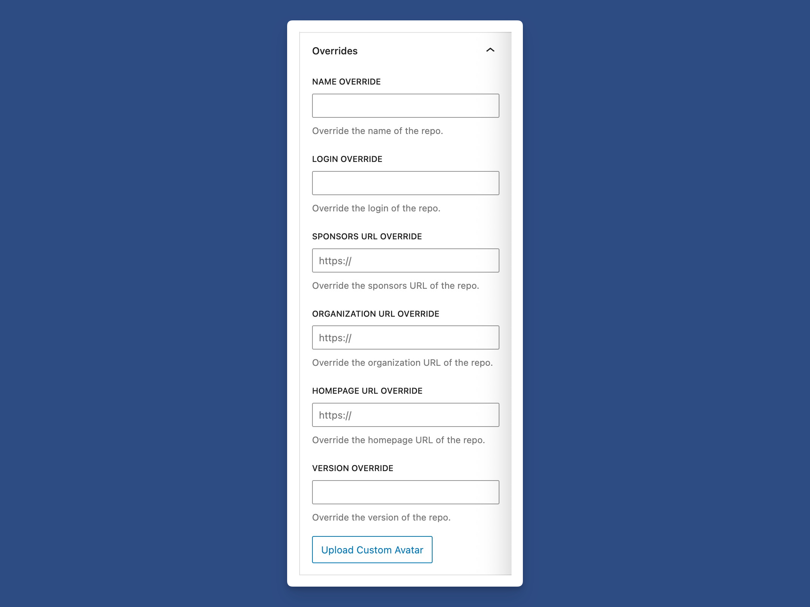
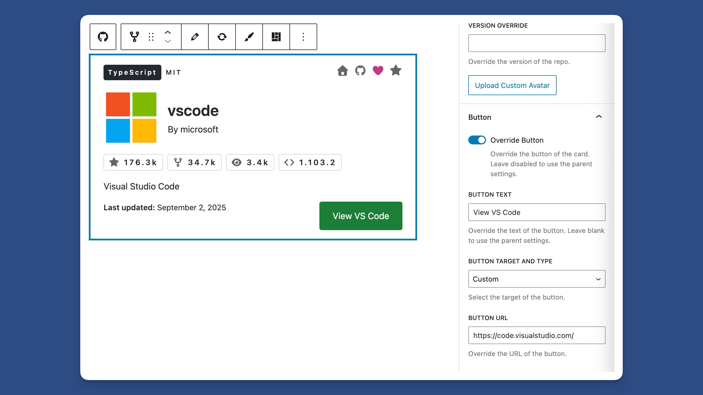

# The GitHub Info Cards Block

<figure><figcaption></figcaption></figure>

The block allows you to insert any public repository and display it in a beautiful layout.

First is finding the block, which I recommend using a `/` command for.

### Inserting the Block

Using the slash command, find the GitHub Info Cards Grid block. Use slash command: `/git`

<figure><figcaption>
Use Slash Command <code>/git</code> to Find the Block
</figcaption></figure>

From there, you can enter the repo information, including username and repo.

<figure><figcaption>
Gif of Inserting and Adding the Repo
</figcaption></figure>

### Configuring the the Parent Block

The blocks are split into two. You have a main grid block and a child GitHub Info Card block.

In the main block's toolbar, you'll find the following shortcuts.

<figure><figcaption></figcaption></figure>

1. Switch themes
2. Switch between Large and Card layouts
3. Add a New Card

You can also switch themes via the block's sidebar options.

<figure><figcaption>
Sidebar Block Theme Options
</figcaption></figure>

If multiple cards are in one grid, the grid layout settings will be displayed.

<figure><figcaption>
Grid Layout Settings
</figcaption></figure>

You can also control the visibility settings of certain sections by toggling them on or off. This applies to all cards within the grid.

<figure><figcaption>
Controlling the Visibility Settings of the Parent Block
</figcaption></figure>

### Configuring the Child Block - GitHub Info Card

<figure><figcaption>
The GitHub Info Card Child Block Toolbar
</figcaption></figure>

The child block's toolbar allows you to:

1. Edit the GitHub repo's username and repo name.
2. Refresh the repo in the block editor.
3. Change the theme of all child blocks.
4. Change the appearance of all child blocks.

<figure><figcaption>
Child Block Overrides of the GitHub Info Card
</figcaption></figure>

For the child block, the block controls allow you to override various sections of the card, including:

* Repo name
* Repo author
* Homepage URL
* Sponsors URL
* Upload a custom avatar

Additional button controls allow you to customize the button, both in changing the button's text, and the button's URL.

<figure><figcaption>
Button Overrides in the Child Block
</figcaption></figure>

Lastly, you would publish the changes and view the cards on your site.
