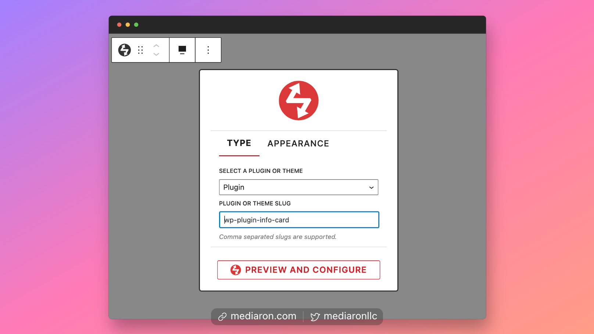
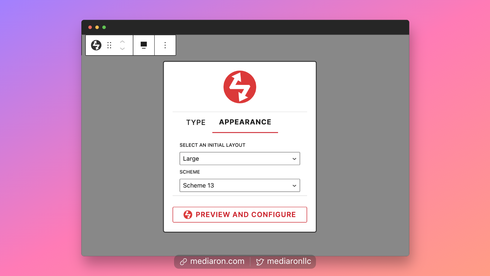
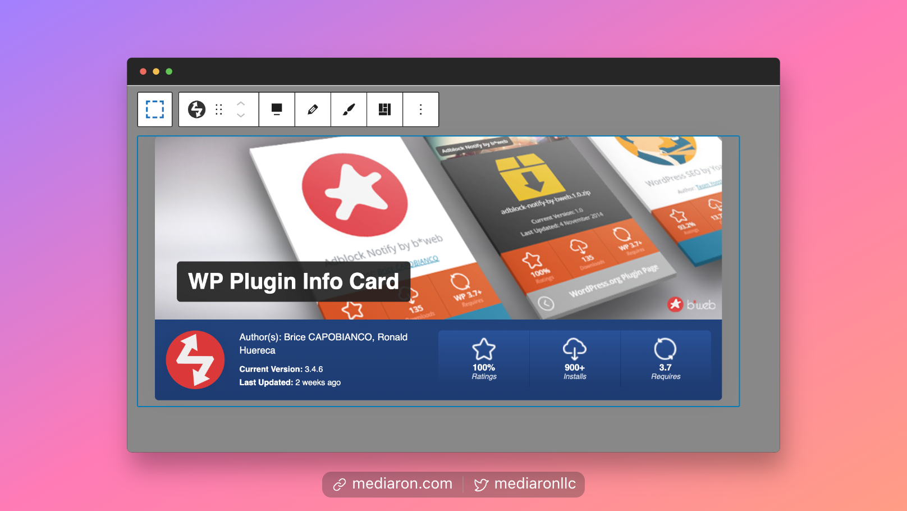
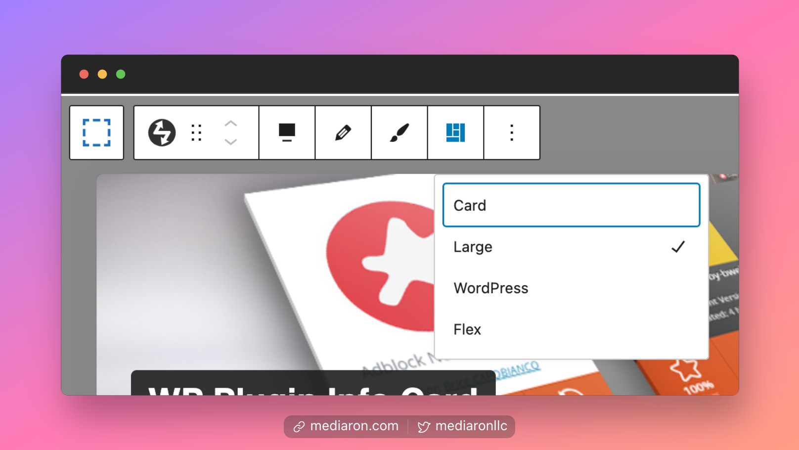
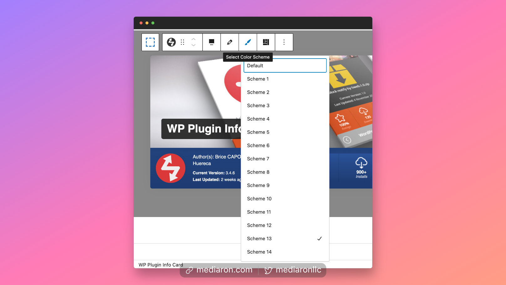
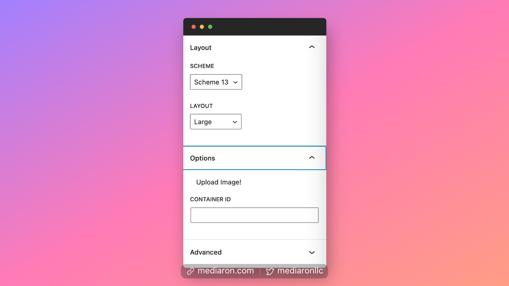

# WP Plugin Info Card Block

The WP Plugin Info Card block is essentially a wrapper for the `wp-pic` shortcode.

When first inserting the block, you'll be presented with entering a type and plugin slug.

<figure><figcaption>
Type tab: Enter a Type and Slug on the Main Block Screen
</figcaption></figure>

The slug can be comma-separated if you would like to display more than one plugin or theme at a time.

Switching to the Appearance tab will allow you to select a layout and a scheme.

<figure><figcaption>
Appearance Tab: Set Layout and Scheme
</figcaption></figure>

Once you've selected a slug and layout, you can click on `Preview and Configure`. This will reveal an info card for a plugin or theme.

<figure><figcaption>
Preview View
</figcaption></figure>

From the block's toolbar menu, you can edit the scheme and layout of the info card.

<figure><figcaption>
Change the Layout
</figcaption></figure> <figure><figcaption>
Change the Color Scheme
</figcaption></figure>

Finally, you can also set the layout/scheme in the sidebar options as well.

<figure><figcaption>
Sidebar Options
</figcaption></figure>
