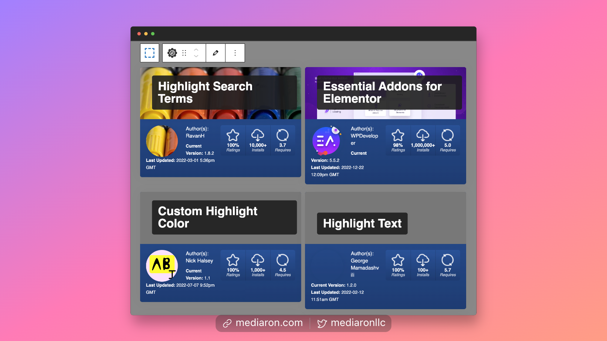
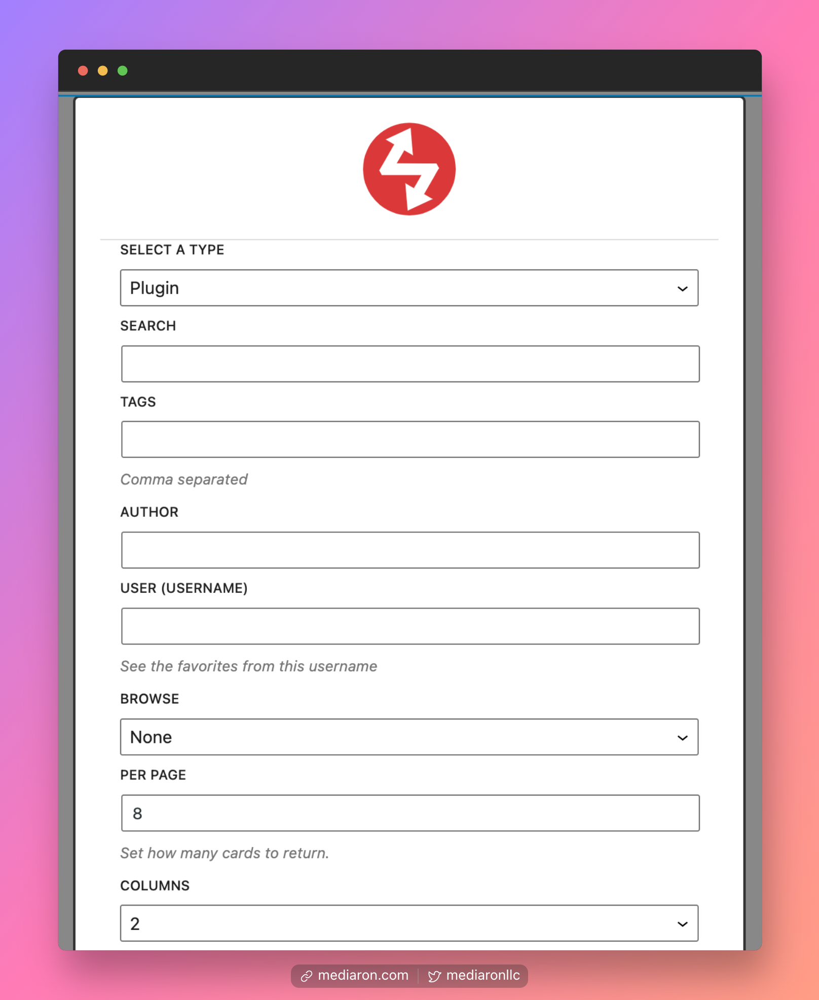
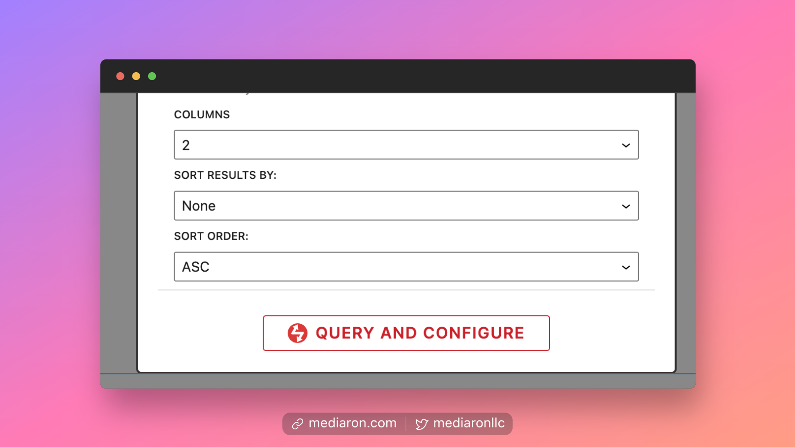
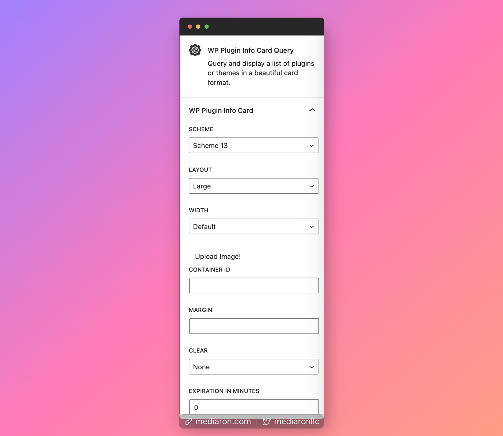

# WP Plugin Info Card Query Block

<figure><figcaption>
Two-column Layout for the Query Block
</figcaption></figure>

When you first insert the block, you will be prompted to enter some query parameters.

<figure><figcaption>
Query Based on Several Parameters
</figcaption></figure>

You can also sort the results by active installs, downloads, or last updated.

<figure><figcaption>
Sort the Results Even Further
</figcaption></figure>

Once you click on `Query and Configure`, you can further customize using the sidebar options.

<figure><figcaption>
Set the Sidebar Options for the Query Block
</figcaption></figure>
