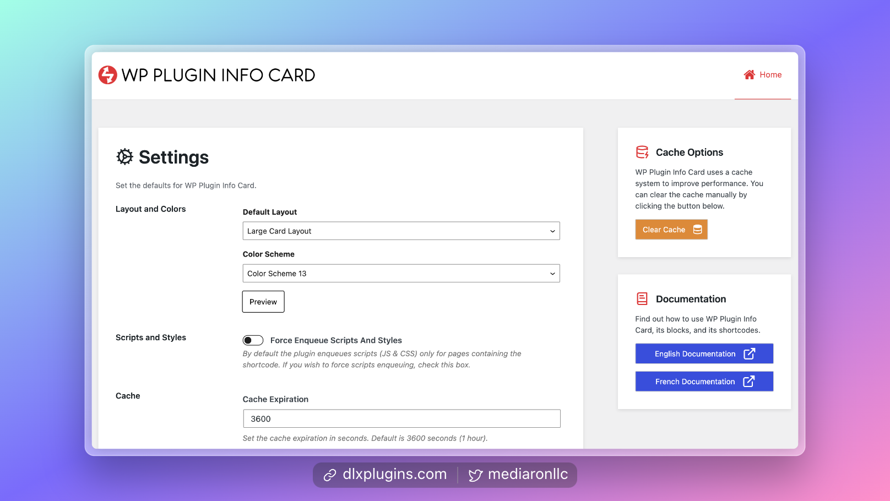
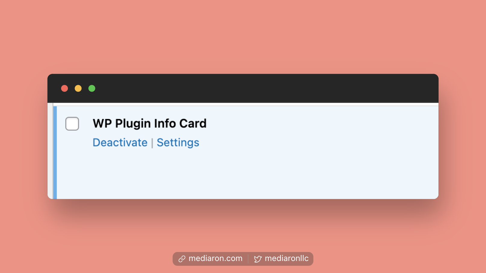
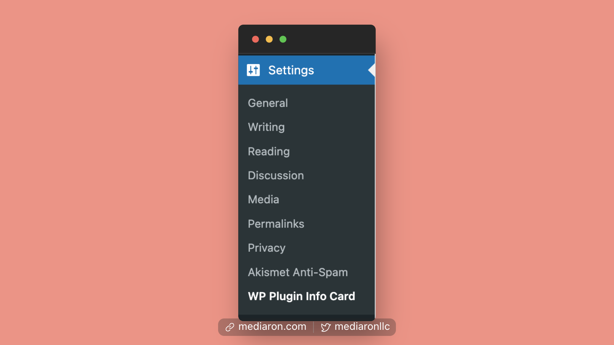

# Finding the Admin Settings

<figure><figcaption>
Admin Settings for the Plugin
</figcaption></figure>

## Finding the Admin Settings From the Plugins Screen

If you are on the plugin's screen, search for `WP Piugin Info Card` and click on the `Settings` link.

<figure><figcaption>
WP Plugin Info Card on the Plugins Screen
</figcaption></figure>

## Finding the Admin Settings from the Menu

Alternatively, in the admin menu, head to `Settings->WP Plugin Info Card`.

<figure><figcaption>
Settings Menu
</figcaption></figure>
