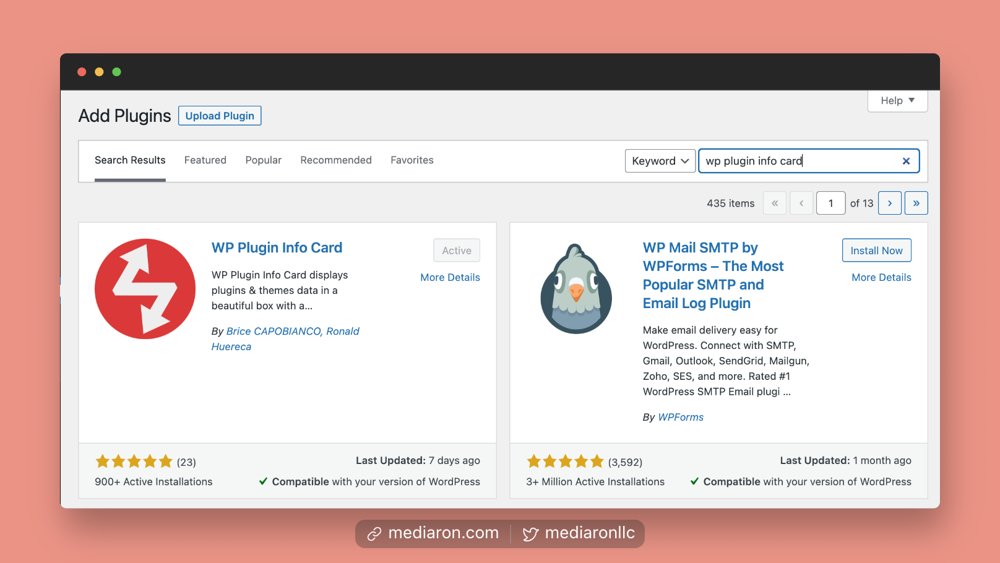

# Installation

## Install from the WordPress Admin

<figure><figcaption>
Add WP Plugin Info Card via Plugins Add New
</figcaption></figure>

1. Log into your WordPress admin (i.e., your dashboard)
2. Go to Plugins->Add New
3. Type in WP Plugin Info Card
4. Install the plugin
5. Activate the plugin

After activation, you will be taken to the plugin's settings screen.
