# Custom Plugin Cards

<figure>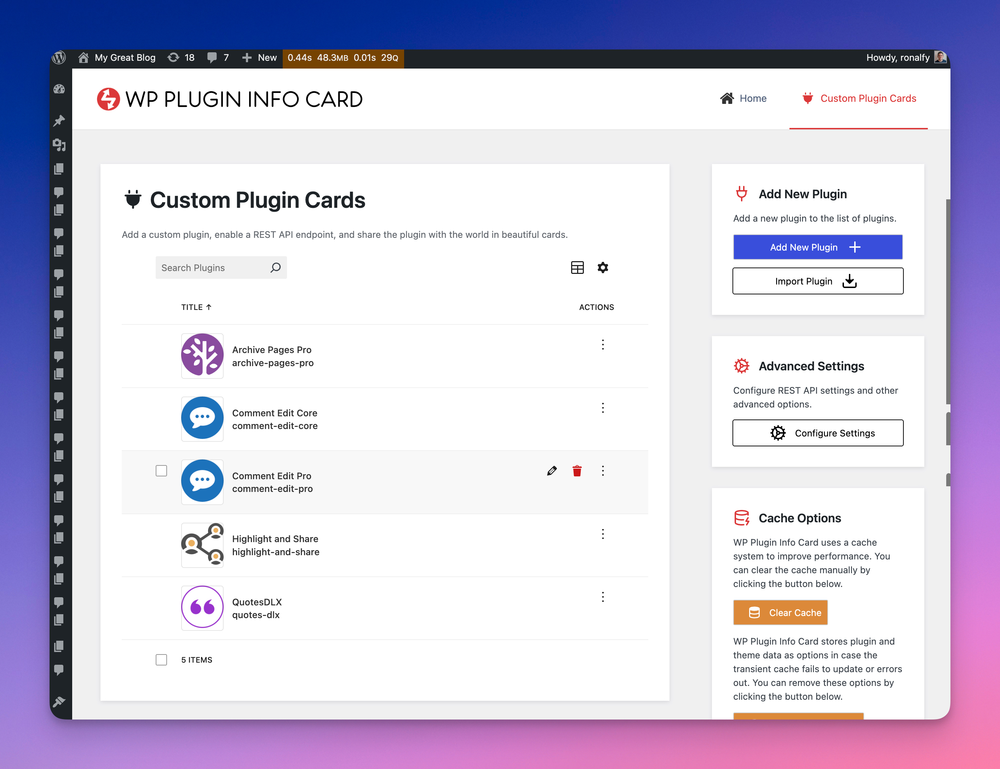<figcaption>
Custom Plugin Cards with WP Plugin Info Card
</figcaption></figure>

Custom Plugin Cards are the latest addition to WP Plugin Info Card. They allow you to create third-party plugins that can be shared with the world and displayed using WP Plugin Info Card.

### Features

1. Create and display third-party plugins.
2. Configure whether Custom Plugin Cards and REST are enabled.
3. Enable or disable a REST API for your plugin.
4. Export single or multiple plugins to a JSON file.
5. Import single or multiple plugins via a JSON file.
6. Copy and share a REST URL to import a plugin remotely.
7. Keep third-party plugins up to date with the REST API.

### Adding a New Third-party Plugin

<figure>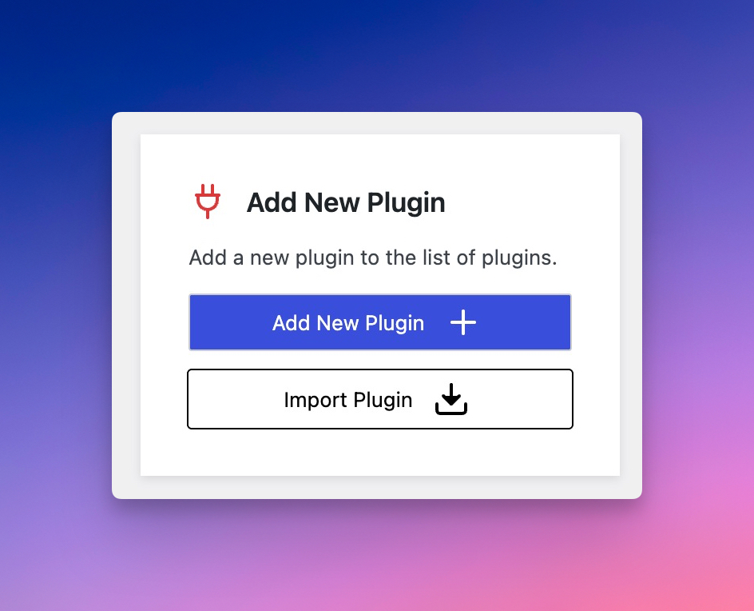<figcaption>
Click "Add New Plugin" to Create a New Plugin
</figcaption></figure>

Click on "Add New Plugin" in the sidebar to create a new plugin.

<figure>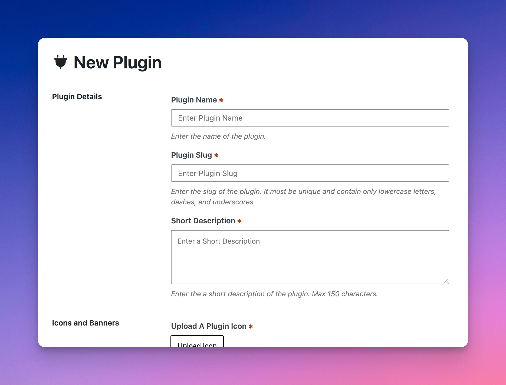<figcaption>
Add New Plugins Screen
</figcaption></figure>

You'll be prompted to enter several pieces of information about the plugin. Please fill in as much information as possible. You're able to edit it later.


**The Plugin Slug**: The plugin slug will be used in WP Plugin Info Card to display the plugin.


<figure>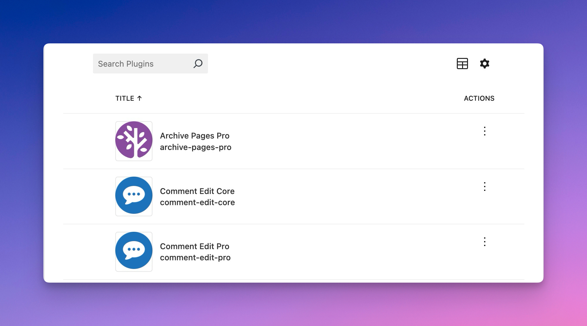<figcaption>
Plugin List Screen in the Admin
</figcaption></figure>

Once you've saved the plugin, it'll display in the plugin list. You can then use the slug to display the plugin using WP Plugin Info Card.

### Configure Whether Custom Plugin Cards and the REST API Are Enabled

To configure Custom Plugin Cards, head to the advanced settings in the admin panel.

<figure>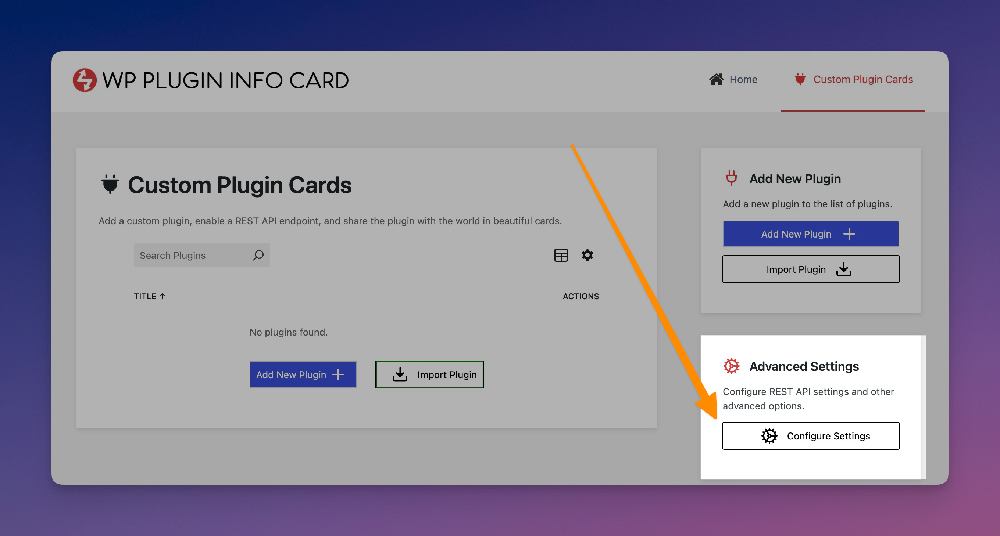<figcaption>
Advanced Settings for Custom Plugin Cards
</figcaption></figure>

Click on "Configure Settings" to reach the settings for Custom Plugin Cards.

<figure>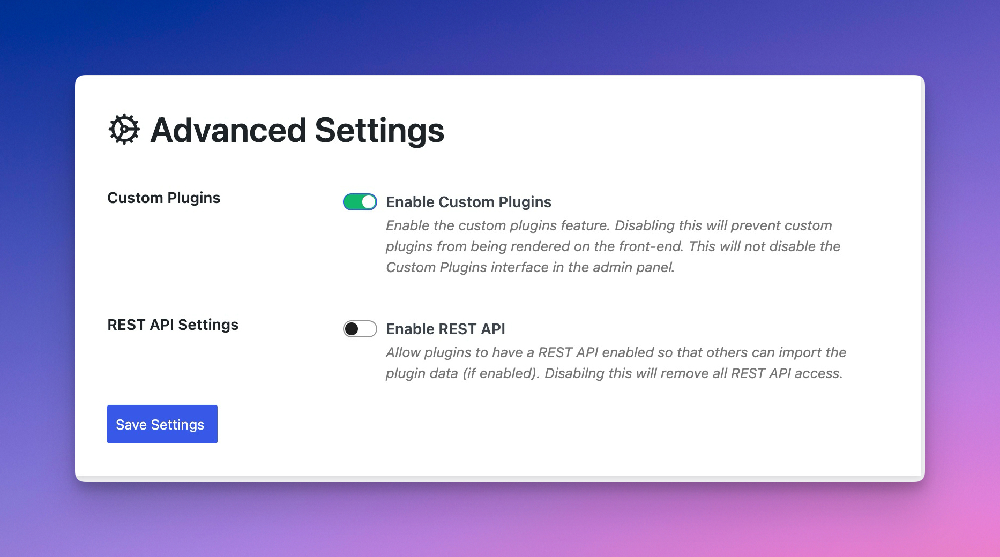<figcaption>
Advanced Settings in the Admin
</figcaption></figure>

From the Advanced settings, you can configure whether custom plugins are enabled. If disabled, no custom plugins will display on the frontend. If enabled, then the custom plugins created will be displayed if available.


**Plugin Slugs**: The slugs, if a duplicate of .org, will override the .org plugin display.


#### Enabling the REST API

<figure>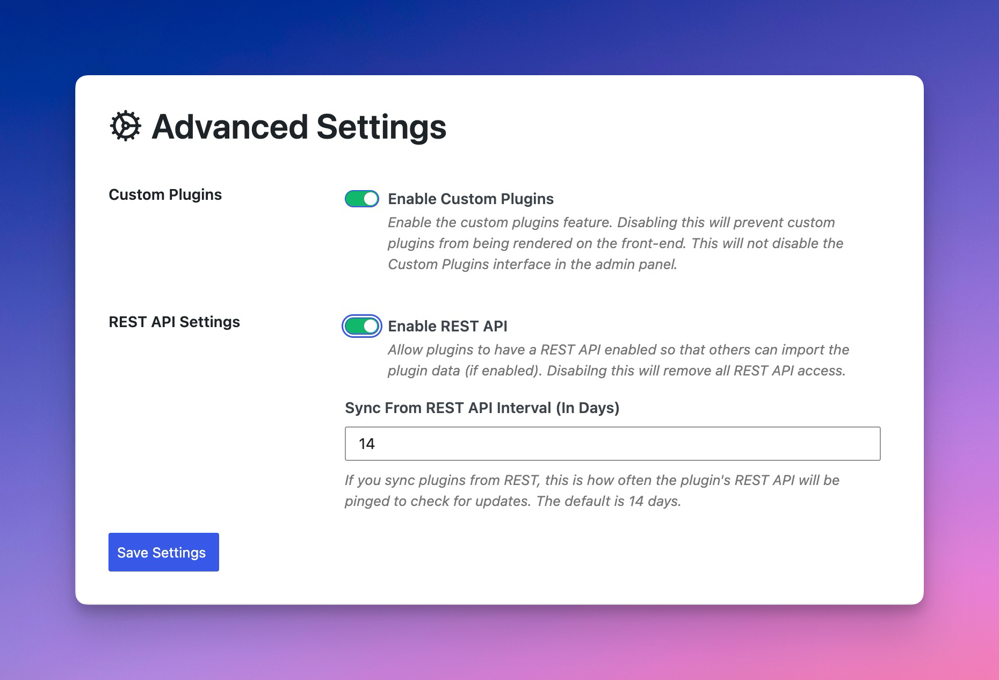<figcaption>
REST API Options in Custom Plugin Cards
</figcaption></figure>

If you choose to enable the REST API, then any plugin you create can have a REST API endpoint available. This REST URL can be shared with other users, and the plugin can be imported and synced via this REST API.

Once enabled, you can also choose how often you ping the REST APIs you are subscribed to. The recommended time is 14 days, but you can adjust this sooner or later.

Please note that this relies on others having their REST API available for consumption. A user can enable their REST API for the initial import, but restrict it later.

### Enable a REST API for a Plugin

When editing a plugin, you can enable a REST API for the plugin.

<figure>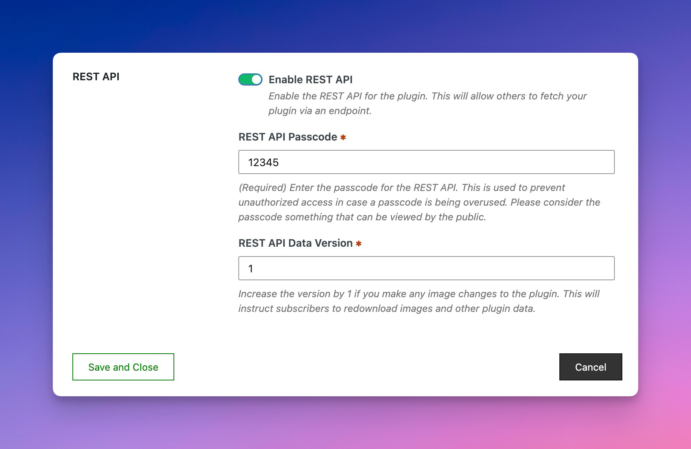<figcaption>
Enable a REST API for a Plugin
</figcaption></figure>

You can set a passcode so that others can access your REST API URL. If you don't want people to access your REST API to update a plugin, you can change the passcode or disable REST in the admin settings.

The `REST API Data Version` is used to alert others when your data has changed, particularly with the images. The text is auto-updated, but the images will only be auto-updated if the version has changed.

You can copy a plugin's REST URL by clicking the contextual menu on the plugin's screen and copying it.

<figure>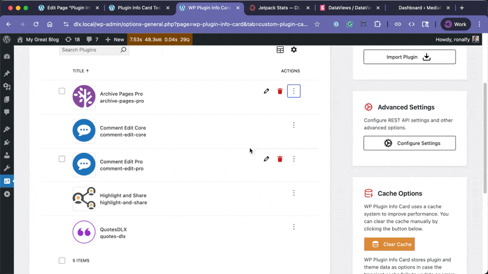<figcaption>
Copying a REST URL
</figcaption></figure>

Once copied, a REST URL can be imported.

### Exporting Single or Multiple Plugins

An individual plugin may be exported by opening the Contextual Menu and clicking Export Plugin. This plugin will then be exported via a JSON format.

You can export multiple plugins by clicking the checkbox options for a plugin.

<figure>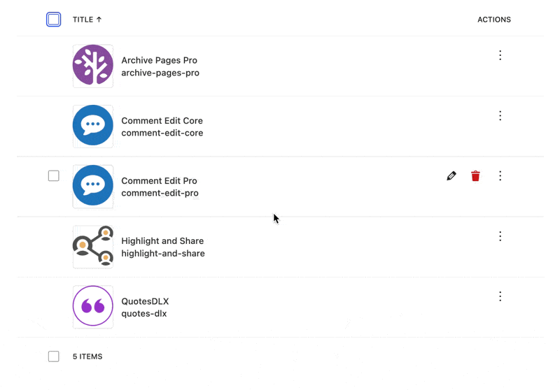<figcaption>
Export Multiple Plugins
</figcaption></figure>

Import a plugin by clicking the "Import Plugin" button.

<figure>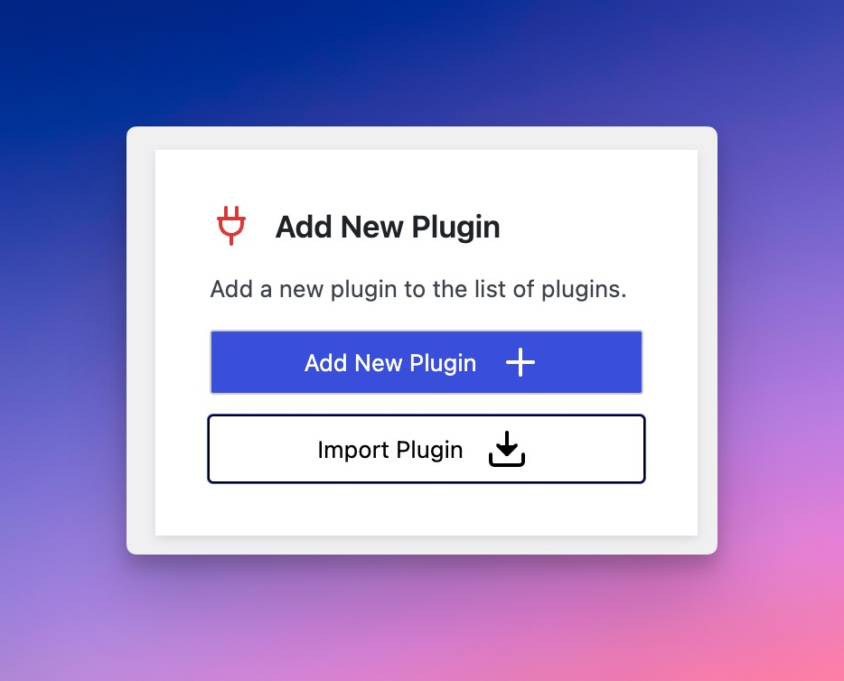<figcaption>
Import Plugin Button
</figcaption></figure>

Select a "JSON" file exported from WP Plugin Info Card.

<figure>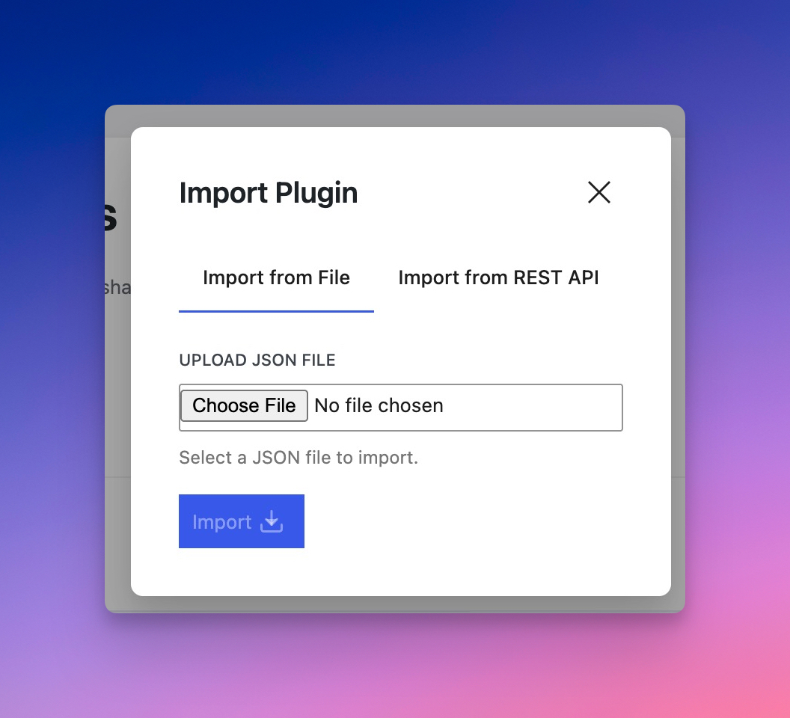<figcaption>
Select JSON File From WP Plugin Info Card
</figcaption></figure>

Once the import is successful, the plugin will show up in your plugin list.

### Importing From REST

Once someone has shared a REST URL with you, you can import it by clicking the "Import Plugin" option and selecting "Import from REST API."


Importing from REST


### Displaying Your Plugin

You can use the plugin's slug to display it using WP Plugin Info Card.

<figure>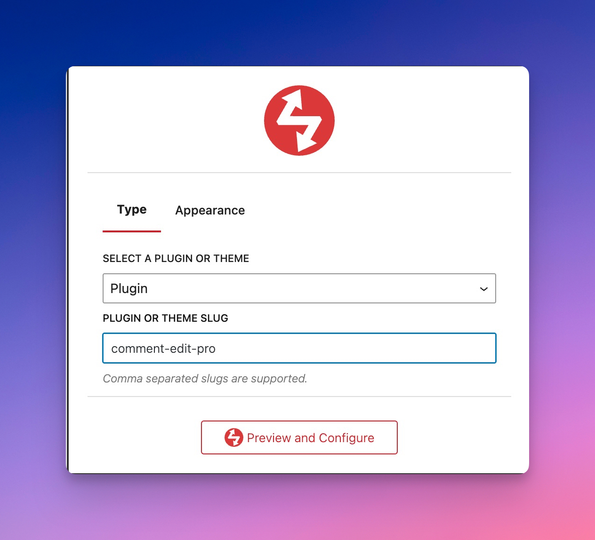<figcaption>
Enter the Slug for the Plugin Info Card Block and Shortcode Settings
</figcaption></figure>

You'll then be able to preview the block on the frontend.

<figure>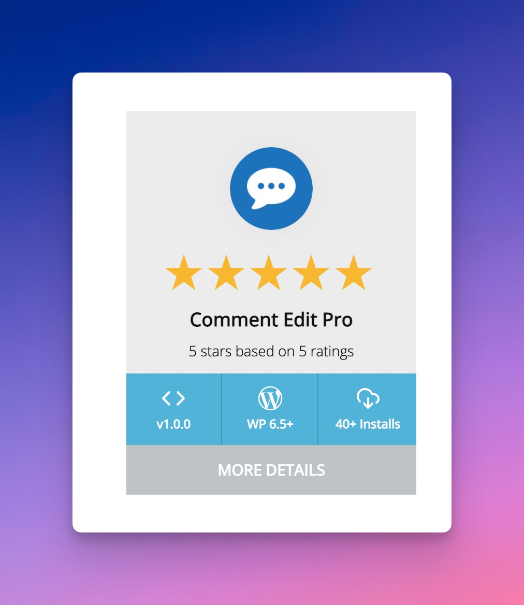<figcaption>
Plugin Card on the Frontend
</figcaption></figure>

