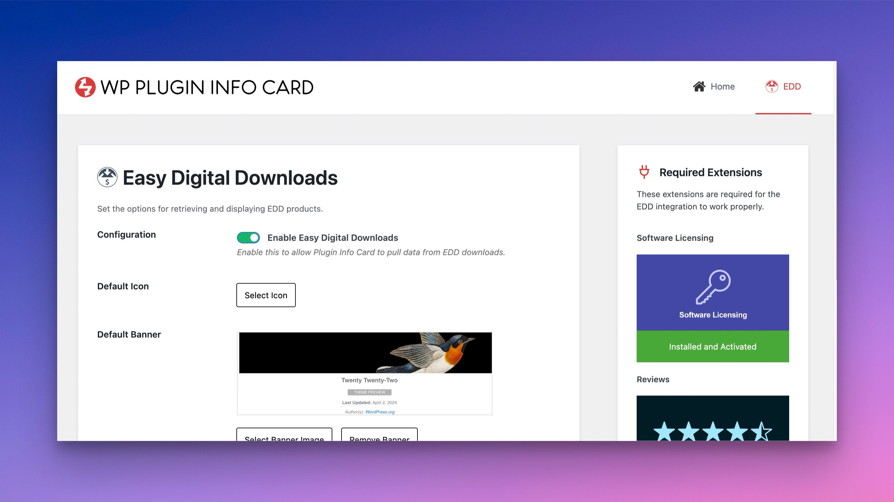
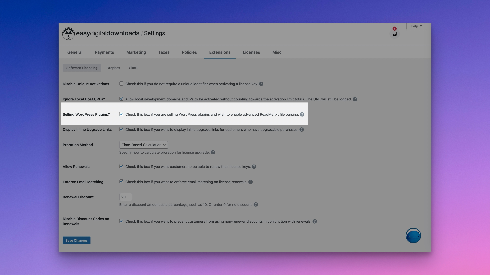
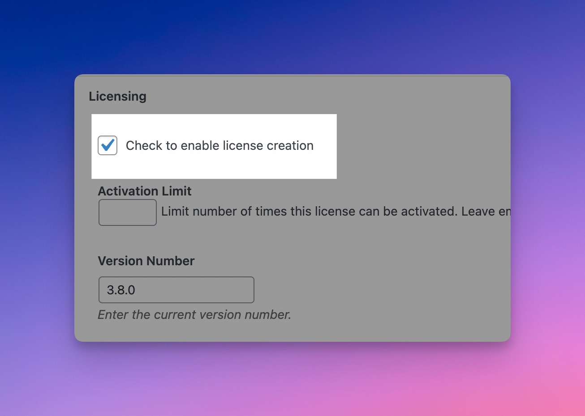
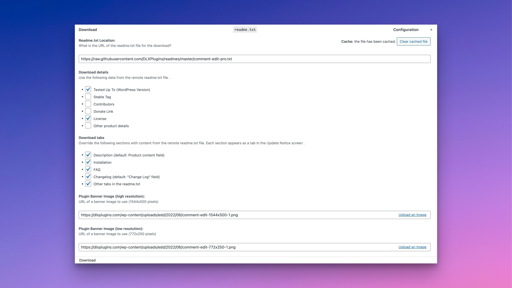
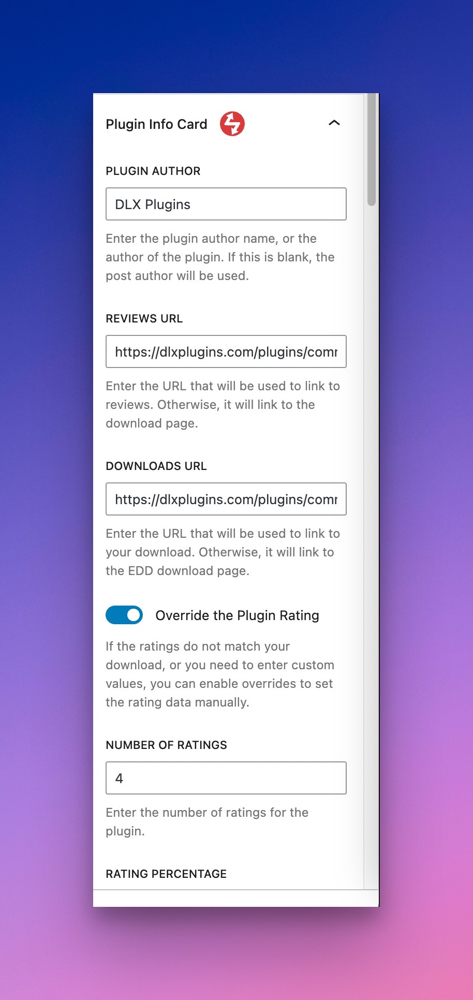
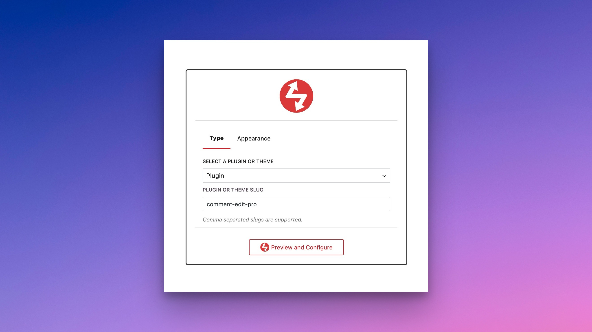
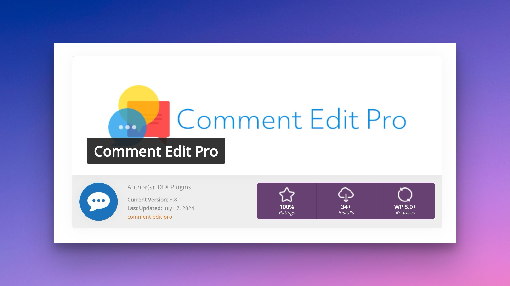
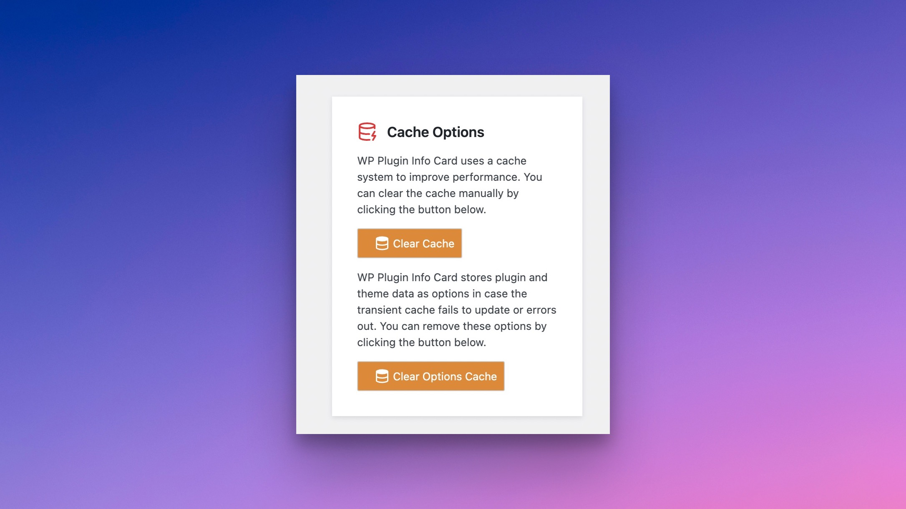

# Easy Digital Downloads Integration

[Easy Digital Downloads](https://easydigitaldownloads.com/?ref=4846) is a great tool for selling plugins, and now with WP Plugin Info Card, you can now show these plugins on the frontend using WP Plugin Info Card.

### Required Extensions

For the EDD integration to work correctly, it is recommended that you have two add-ons installed:

1. [Software Licensing](https://easydigitaldownloads.com/downloads/software-licensing/?campaign=gitbook\&ref=4846) (Required)
2. [Product Reviews](https://easydigitaldownloads.com/downloads/product-reviews/?campaign=gitbook\&ref=4846) (Recommended, not Required)

### Enabling EDD

Head to the Plugin Info Card admin options and select the EDD tab.

<figure><figcaption>
EDD Tab in Plugin Info Card
</figcaption></figure>

Check the "Enable Easy Digital Downloads" toggle and switch it to on. Save your settings.

### Enable Readme Parsing in EDD (Highly Recommended)

Head to EDD's settings under **Extensions**. Make sure readme parsing is enabled and that you have a valid downloadable readme.

<figure><figcaption></figcaption></figure>

### Edit Your Download and Enable License Creation


License creation must be enabled


License creation must be enabled in order to sell your downloads. It is also required to show your plugins using the WP Plugin Info Card, as it enables extra fields for your plugin..

<figure><figcaption>
Make Sure License Creation is Enabled
</figcaption></figure>

### Edit Your Download and Add Your Plugin Information

<figure><figcaption>
Plugin Information in EDD
</figcaption></figure>

Add as much plugin information as possible to your download, including:

1. Setting a Download image (featured image)
2. Setting a banner image
3. Plugin homepage

Make sure your Readme has as much information as possible as well.

### Edit EDD Download Plugin Info Card Settings

You'll find additional settings for the Plugin Info Card in the right sidebar. Make sure these are filled out for each download.

You can also override the ratings if you don't have the Reviews plugin installed or have ratings elsewhere.

<figure><figcaption>
Plugin Info Card Setings for the Download
</figcaption></figure>

### Adding the Card

You can add the card either via block or shortcode.

<figure><figcaption>
Using a Block to Add an EDD Plugin
</figcaption></figure>

The card will show up as normal on the frontend, albeit with EDD data.

<figure><figcaption>
Plugin Info Card Output on the Frontend
</figcaption></figure>

### Clear Cache as Necessary

If you make any changes to your download, you'll have to clear the Plugin Info Card cache.

You can do so by clearing the transient and options cache.

<figure><figcaption>
Cache Clearing Options on Plugin Info Card
</figcaption></figure>

### Need Additional Support

If you need additional support getting Plugin Info Card working with Easy Digital Downloads, please [reach out to support](https://dlxplugins.com/support/).
