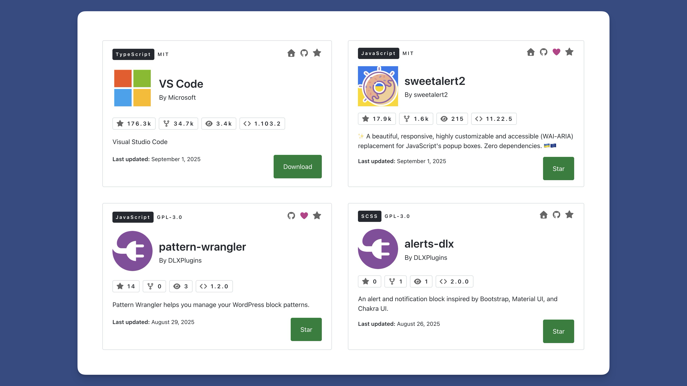
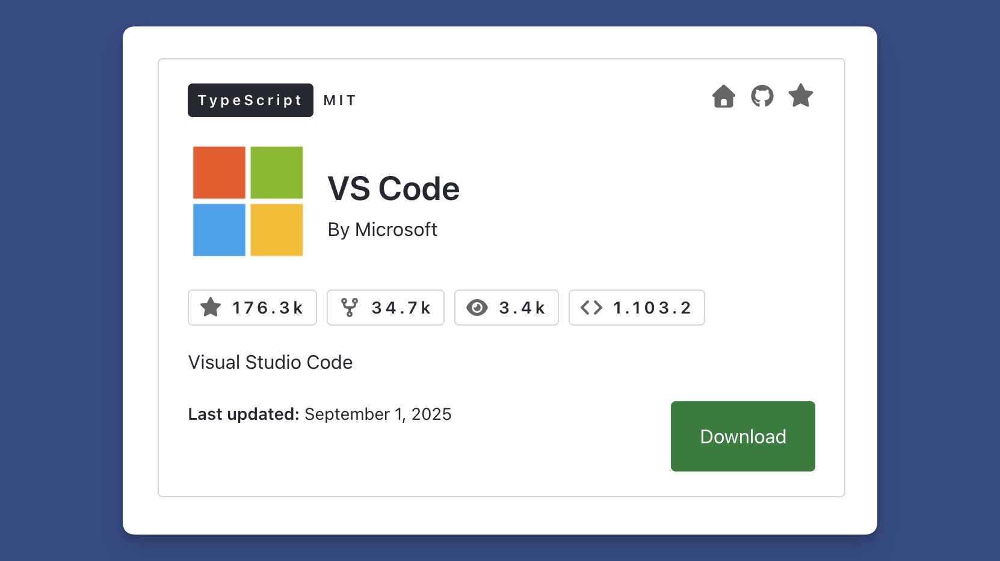
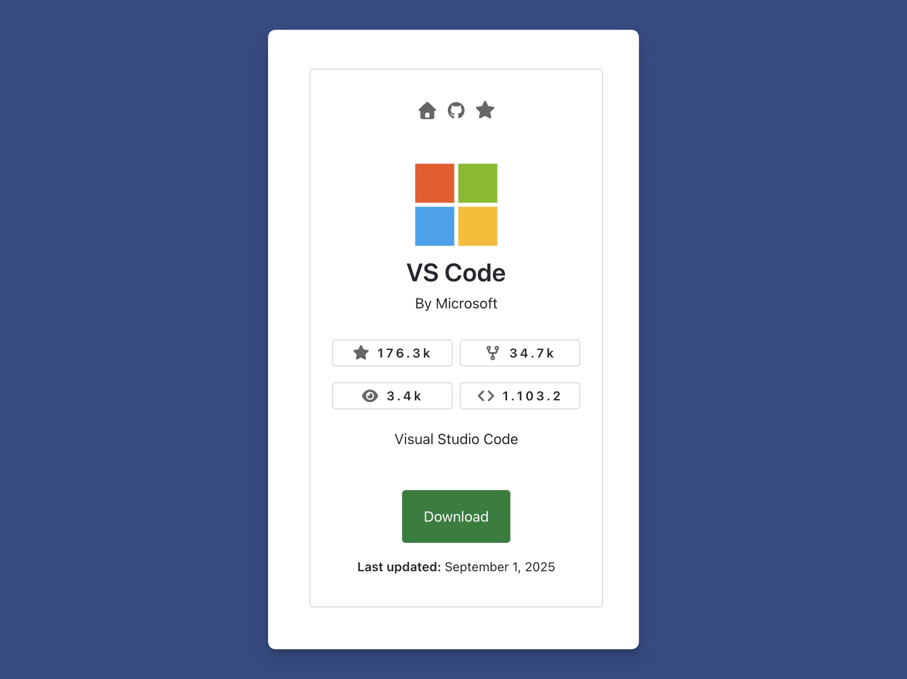
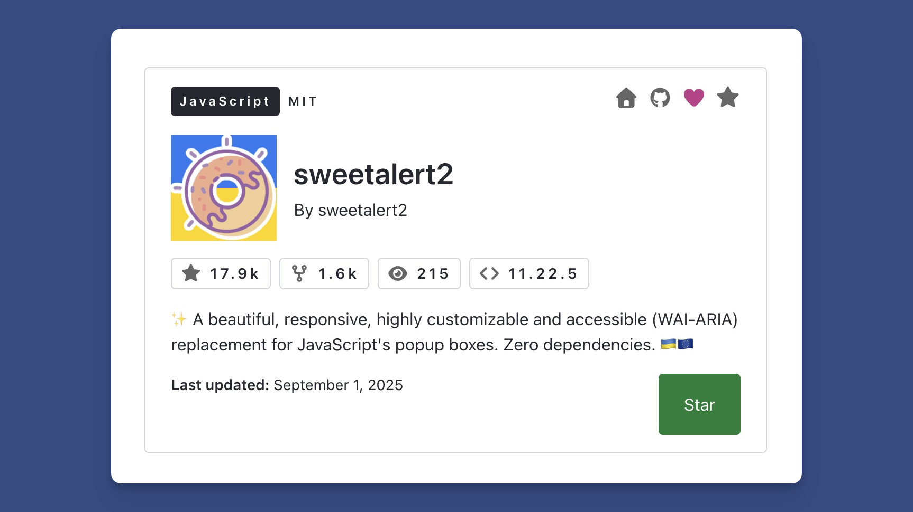
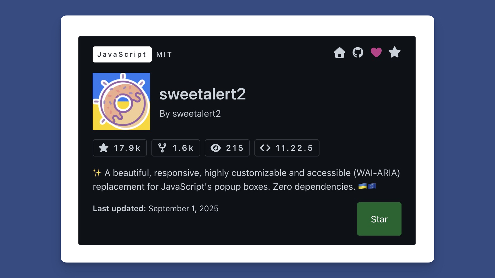
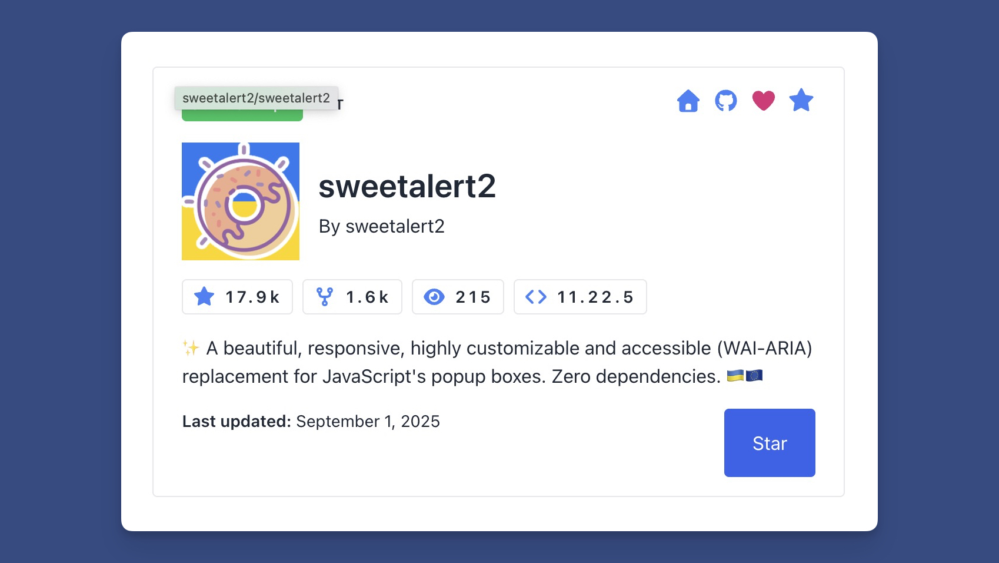
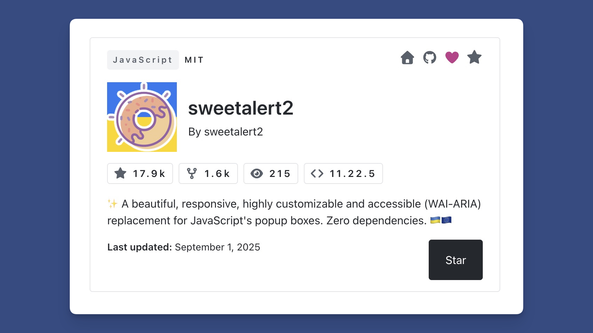
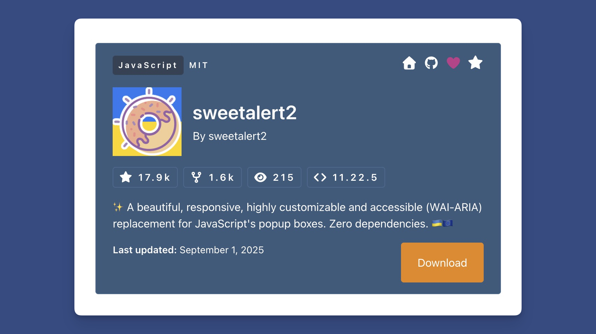

# GitHub Info Cards

<figure><figcaption>
Demo of GitHub Info Cards
</figcaption></figure>

The GitHub integration for WP Plugin Info Cards allows you to share practically any public GitHub repo.


A GitHub Personal Access Token is Required.

To avoid rate limit issues, a GitHub personal access token is required. I've written an article on [how to retrieve a non-expiring GitHub personal access token](https://dlxplugins.com/how-tos/how-to-create-a-non-expiring-github-personal-access-token/).


A GitHub Info Card can be added via the [block editor](../../blocks/the-github-info-cards-block.md) or [shortcode](../../shortcodes/github-info-card.md).


[enabling-github-info-cards.md](enabling-github-info-cards.md)


### Layouts

The cards can be displayed in a Large or Card layout.

It features:

* A top bar with language, license, and quick links.
* An author bar with avatar, repo name, and author.
* A stats bar with quick links to stars, forks, watchers, and current release.
* A description.
* A last updated bar and call-to-action.

#### Large Layout

<figure><figcaption>
Large Layout Showing the VS Code GitHub Repo
</figcaption></figure>

The large layout is horizontally aligned and features a prominent call-to-action.

#### Card Layout

<figure><figcaption>
Card Layout Showing the VS Code GitHub Repo
</figcaption></figure>

The card layout is center-aligned and features a prominent stats bar and call-to-action.

### Themes

Here are the various themes for the GitHub Info Cards.

#### GitHub Light

<figure><figcaption></figcaption></figure>

#### GitHub Dark

<figure><figcaption></figcaption></figure>

#### GitHub Colorful

<figure><figcaption></figcaption></figure>

#### GitHub B\&W

<figure><figcaption></figcaption></figure>

#### GitHub Custom

You can choose from several custom colors to make the GitHub card your own.

<figure><figcaption>
GitHub Card With Custom Colors
</figcaption></figure>


[enabling-github-info-cards.md](enabling-github-info-cards.md)



[github-info-card.md](../../shortcodes/github-info-card.md)



[the-github-info-cards-block.md](../../blocks/the-github-info-cards-block.md)

