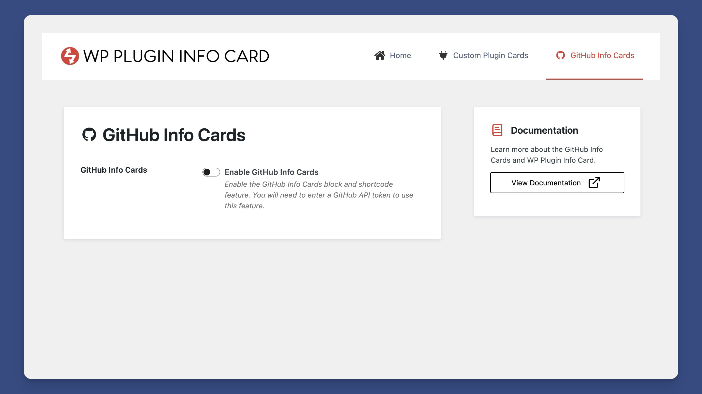
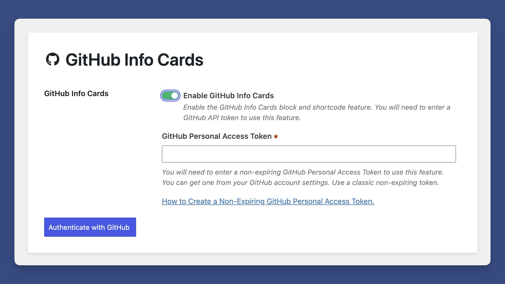
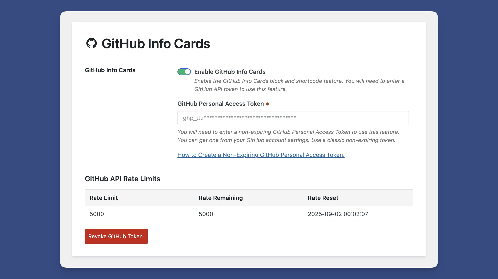

# Enabling GitHub Info Cards

By default, GitHub Info Cards are disabled. This is because they require a GitHub Personal Access Token to gather repository information.

### Navigate to the Admin Settings and Choose GitHub Info Cards

<figure><figcaption></figcaption></figure>

Navigate to the admin settings and locate the GitHub Info Cards section.


[finding-the-admin-settings.md](../../getting-started/finding-the-admin-settings.md)


### Enable GitHub Info Cards and Add a GitHub Personal Access token.

<figure><figcaption></figcaption></figure>

When prompted, enter your GitHub Personal Access Token. Here's an article on how to [retrieve a non-expiring GitHub personal access token](https://dlxplugins.com/how-tos/how-to-create-a-non-expiring-github-personal-access-token/).

If successful, you will be shown your current rate limit.

<figure><figcaption></figcaption></figure>

You'll now be able to use the GitHub Info Cards block and shortcode.


[github-info-card.md](../../shortcodes/github-info-card.md)



[the-github-info-cards-block.md](../../blocks/the-github-info-cards-block.md)

