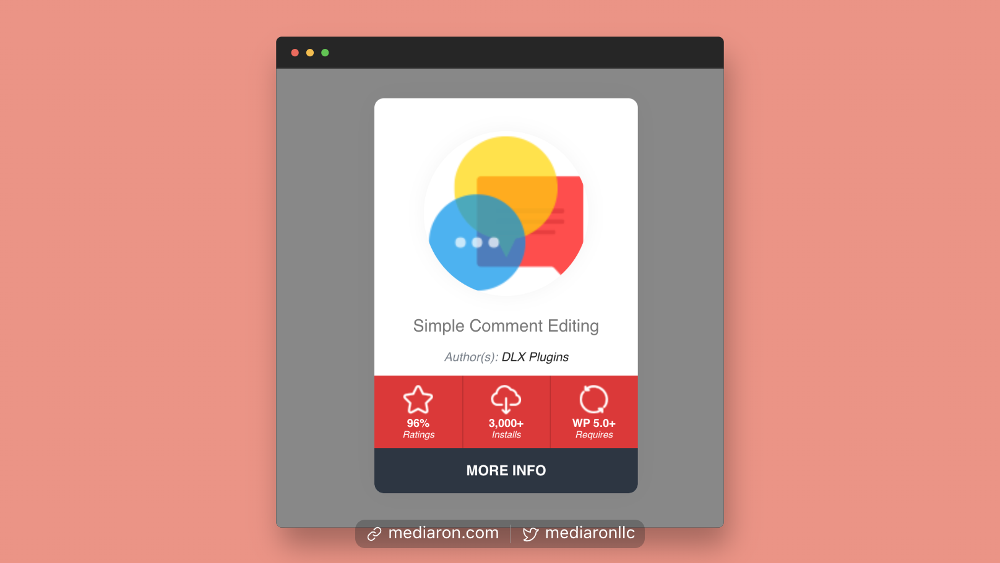
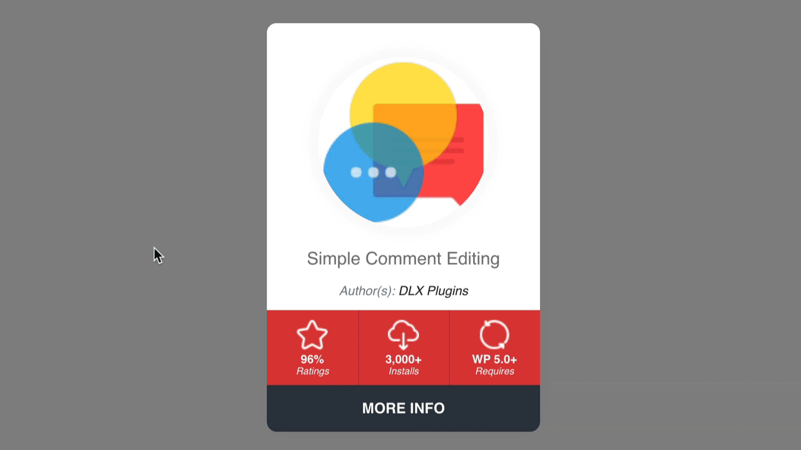
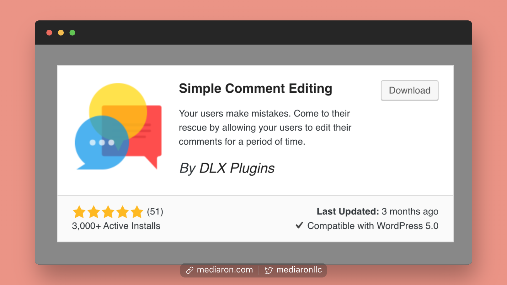
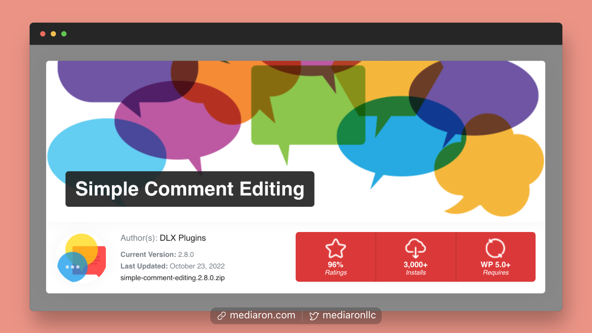
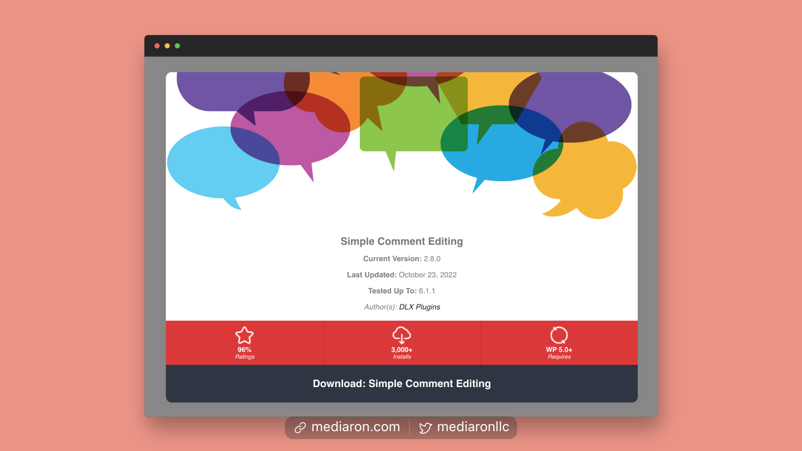
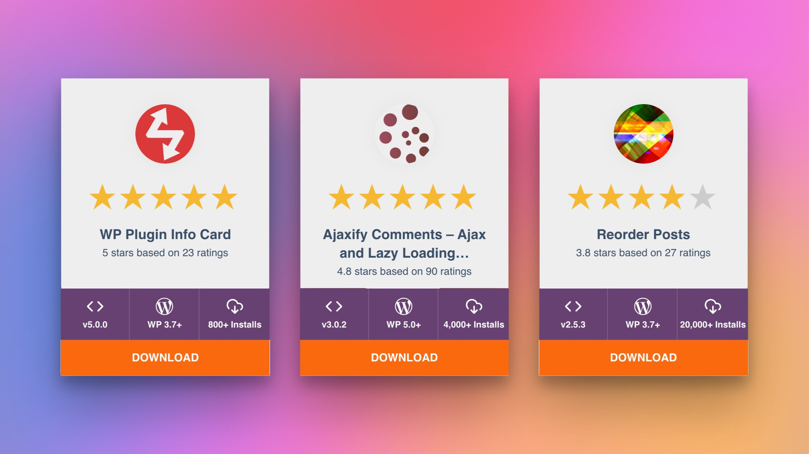

# Layouts

WP Plugin Info Card comes with five different layouts.

### Card Layout

The card layout is a condensed layout that shows some quick stats about the plugin or theme.

<figure><figcaption>
Card Layout
</figcaption></figure>

The Card can be flipped to reveal more information about the plugin or theme.

<figure><figcaption>
The Card Layout has a Flip Effect
</figcaption></figure>

### WordPress Layout

The WordPress layout plays on the default WordPress plugin embed but provides more relevant stats.

<figure><figcaption>
WordPress Layout
</figcaption></figure>

### Large Layout

The Large layout is a larger layout to showcase your plugins or themes in a beautiful bold layout.

<figure><figcaption>
Large Layout
</figcaption></figure>

### Flex Layout

The Flex layout is a layout that stretches and is ideal when you need WP Plugin Info Card to take up the full width of a template.

<figure><figcaption>
Flex Layout
</figcaption></figure>

### Ratings Layout

The Ratings layout puts the plugin rating front-and-center and can quickly show off the quality of a plugin.

<figure><figcaption>
Ratings Layout
</figcaption></figure>
