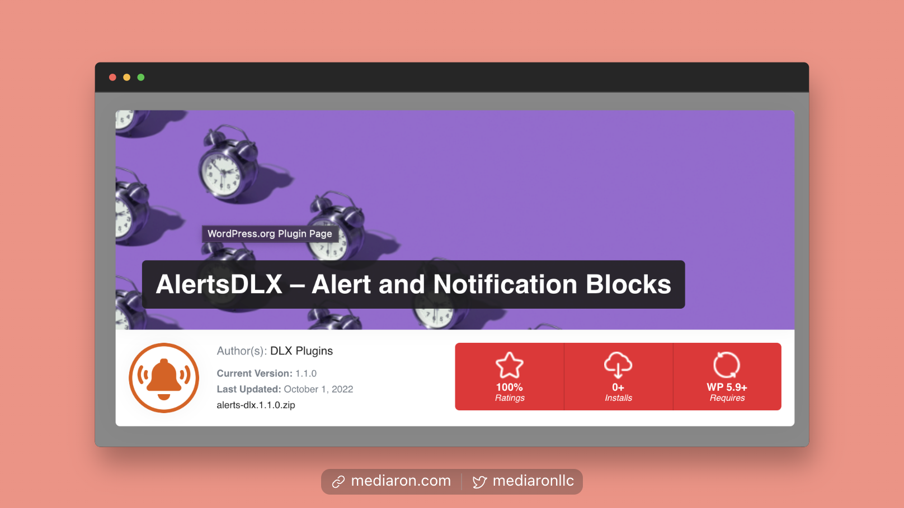
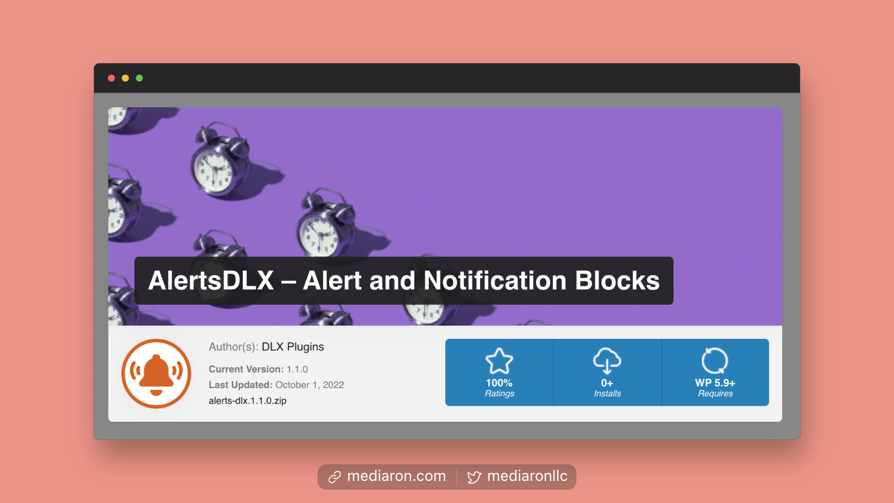
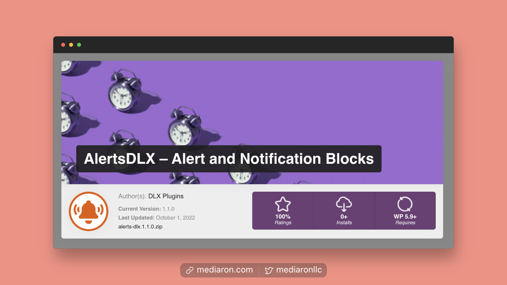
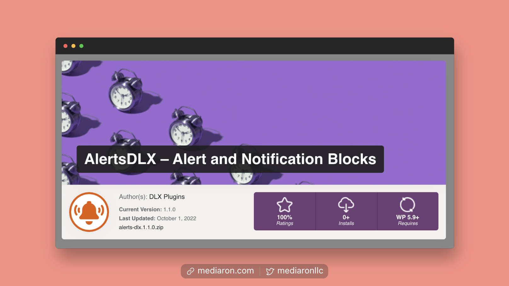
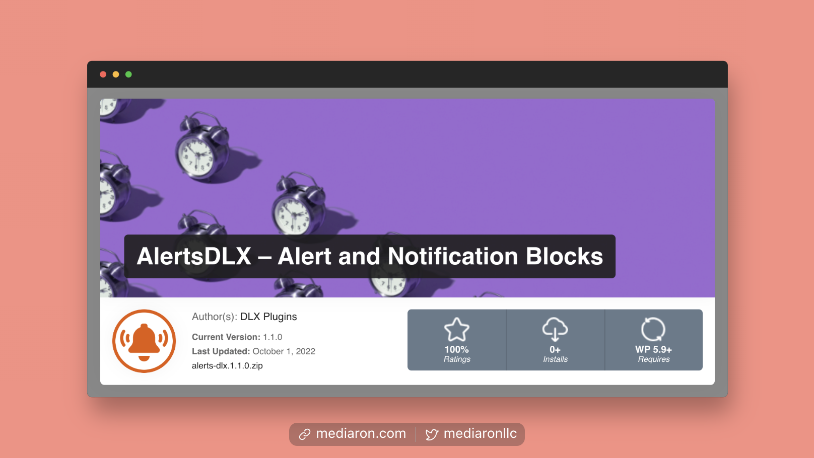
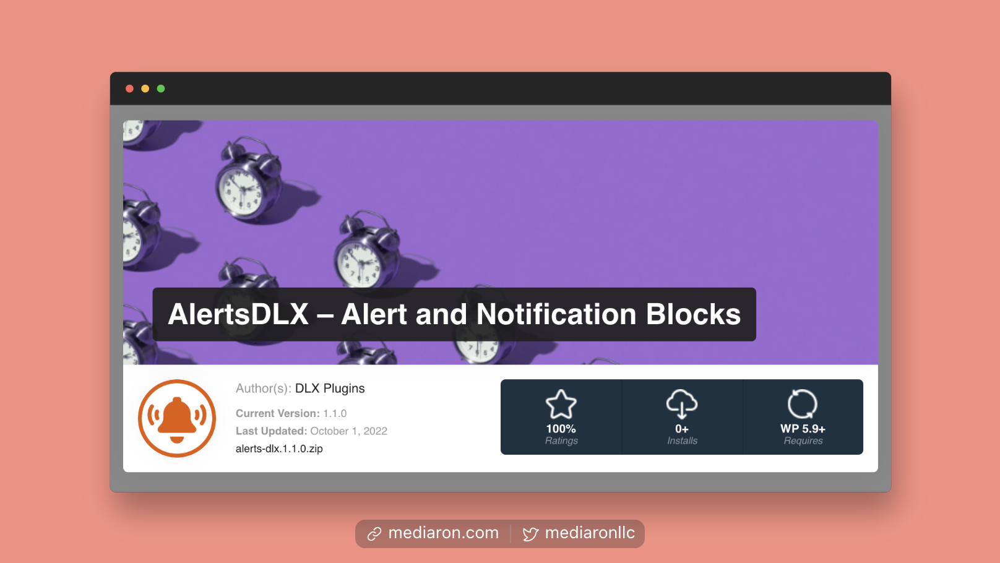
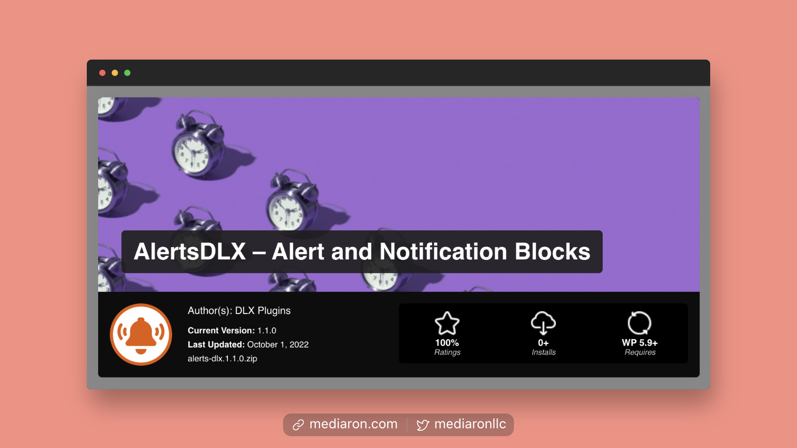
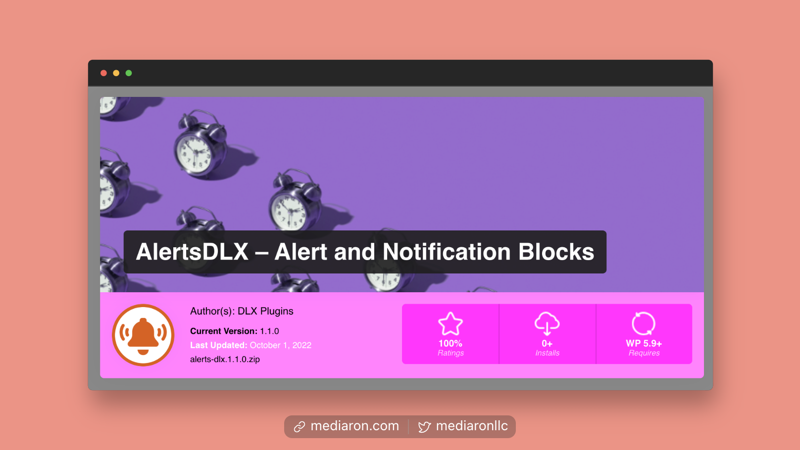
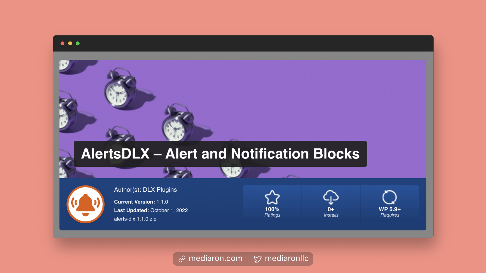
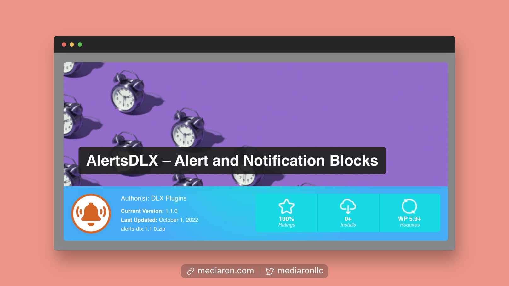

# Schemes

You can easily change the schemes of WP Plugin Info Card to match your site. Please see below for all of the available schemes.

### Scheme 1

<figure><figcaption>
Scheme 1
</figcaption></figure>

### Scheme 2

<figure><figcaption>
Scheme 2
</figcaption></figure>

### Scheme 3

<figure><figcaption>
Scheme 3
</figcaption></figure>

### Scheme 4

<figure><figcaption>
Scheme 4
</figcaption></figure>

### Scheme 5

<figure><figcaption>
Scheme 5
</figcaption></figure>

### Scheme 6

<figure><figcaption>
Scheme 6
</figcaption></figure>

### Scheme 7

<figure><figcaption>
Scheme 7
</figcaption></figure>

### Scheme 8

<figure><figcaption>
Scheme 8
</figcaption></figure>

### Scheme 9

<figure><figcaption>
Scheme 9
</figcaption></figure>

### Scheme 10

<figure><figcaption>
Scheme 10
</figcaption></figure>

### Scheme 11

<figure><figcaption>
Scheme 11
</figcaption></figure>

### Scheme 12

<figure><figcaption>
Scheme 12
</figcaption></figure>

### Scheme 13

<figure><figcaption>
Scheme 13
</figcaption></figure>

### Scheme 14

<figure><figcaption>
Scheme 14
</figcaption></figure>
