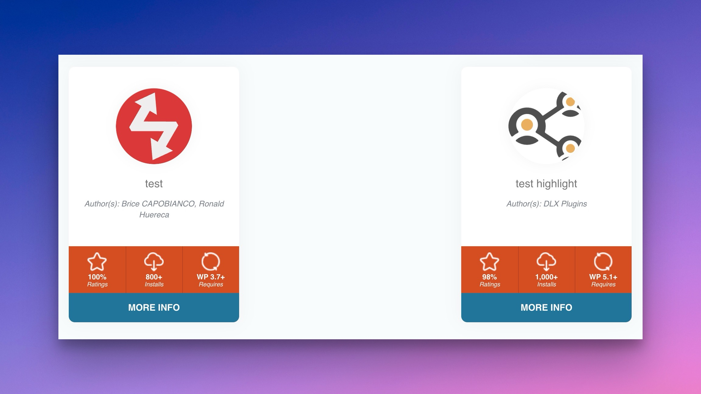
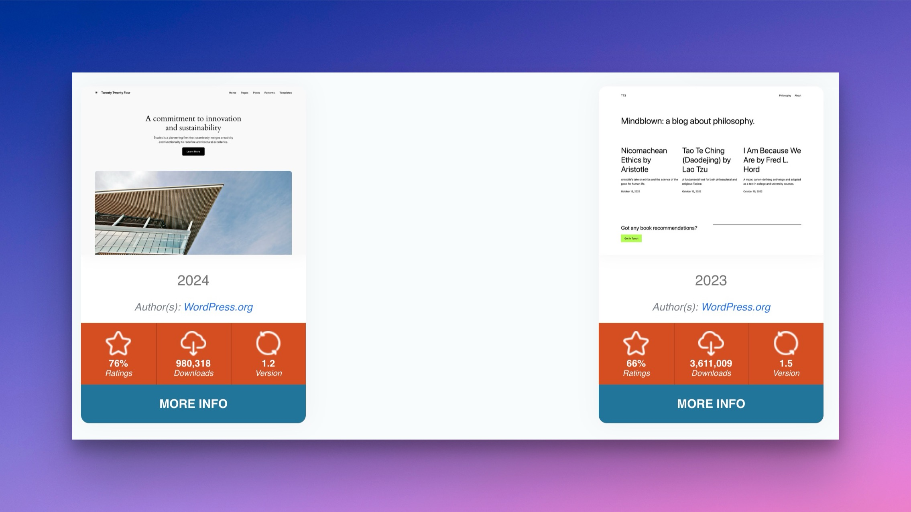

# wp-pic

The `wp-pic` shortcode can be used to display a single or multiple plugins. See below for the shortcode parameters.

Example shortcode:


```
[wp-pic slug="simple-revisions-delete" layout="large" scheme="scheme1" align="right" margin="0 0 0 20px" containerid="download-sexion" ajax="yes"]// Some code
```


### type

Can be of type `plugin` or `theme`. Type `plugin` is default.

```
[wp-pic type="theme" slug="zerif-lite"]
```

### slug

The `slug` (required) parameter can be a single or comma-separated string of plugin slugs.

```
[wp-pic slug="wp-plugin-info-card"]
```

Comma-separate the slugs to be in **multi** mode, which will output multiple plugins.


```
[wp-pic slug="highlight-and-share,simple-comment-editing" multi="true" cols="2" col_gap="40" row_gap="40"]
```


### {slug}={title}

A slug can be set in the shortcode attributes to override the title.

Simply use the plugin or theme slug in the shortcode attributes.

<figure><figcaption><p>Example of a Slug Title Being Overriden</p></figcaption></figure>

Here's an example:


```
[wp-pic slug="wp-plugin-info-card,highlight-and-share" multi="true" cols="2" highlight-and-share="test highlight" wp-plugin-info-card="test"]
```


You can do the same for themes:

<figure><figcaption><p>Example of Theme Overrides</p></figcaption></figure>


```
[wp-pic type="theme" slug="twentytwentyfour,twentytwentythree" multi="true" cols="2" twentytwentyfour="2024" twentytwentythree="2023"]
```


### marginSpacing

This can be set to improve the margin around the plugin card.

* none
* compact
* comfortable
* spacious
* extreme

### marginTarget

Used to target the top, bottom, or both margins of the plugin card.

* both
* top
* bottom

### multi

This must be set to `true` if there are multiple slugs. The following extra attributes assist in `multi` output:

* **cols** (1-3)
* **col\_gap** - Gap in pixels between items
* **row\_gap** - Gap in pixels between rows


```
[wp-pic slug="highlight-and-share,simple-comment-editing" multi="true" cols="2" col_gap="40" row_gap="40"]
```


### layout

Default is “card” so you may leave this parameter empty. The default layout can be set in the admin settings.

Available layouts are:

* card
* large
* flex
* wordpress
* ratings&#x20;

```
[wp-pic slug="wp-plugin-info-card" layout="wordpress"]
```

### scheme

Select a card color scheme.  Available schemes are `scheme1` through `scheme14`. The default scheme can be set in the admin settings.

```
[wp-pic slug="wp-plugin-info-card" scheme="scheme14"]
```

### image

Designate an image that will take the place of a plugin's default banner.

```
[wp-pic slug="wordpress-seo" image="http//www.mywebsite/custom-image.jpg"]
```

### align

Set the alignment of the info card. Values can be:

* center
* left
* right

### containerid

Set the container ID of the plugin wrapper.&#x20;

The default is: `default: wp-pic-PLUGIN-SLUG`.

### margin

Set the margin for the info card. The default is no margin.

```
[wp-pic slug="wordpress-seo" align="right" margin="0 0 0 20px"]
```

### clear

Whether to clear the float of the container. Default is empty.

Choices are:

* below
* after

```
[wp-pic slug="wordpress-seo" clear="after"]
```

### expiration

By default, the info card are cached at 720 seconds, so as to not ping the WordPress plugin API in excess.

You can change this expiration when outputting your cards.

```
[wp-pic type="theme" slug="zerif-lite" expiration="60"]
```

### ajax

Whether to load the plugin in via Ajax.

Choices are: `yes` and `no`.

### custom

Whether to output any strings associated with a plugin or theme.

For plugins: _url, name, icons, banners, version, author, requires, rating, num\_ratings, downloaded, last\_updated, download\_link_

For themes: _url, name, version, author, screenshot\_url, rating, num\_ratings, downloaded, last\_updated, homepage, download\_link_
